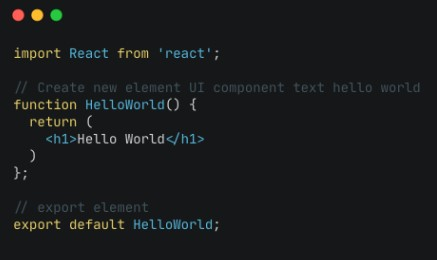
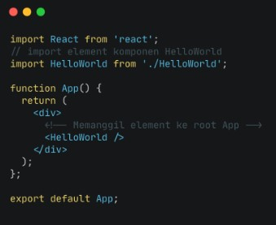
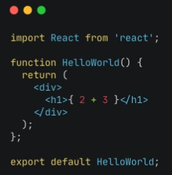
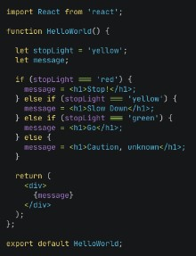
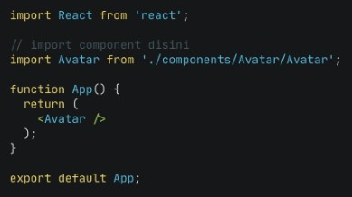
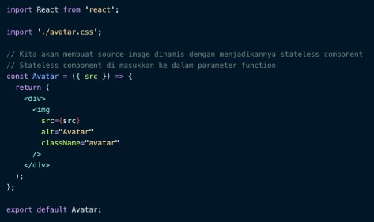
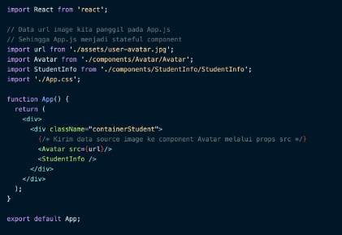
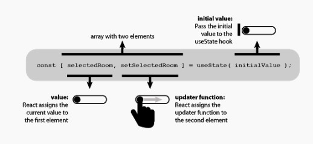

## Intoduction React JS
> * __Apa itu React JS?__  
> React yaitu framework view library Javascript untuk membuat tampilan (user interface) pada website.  
> > React JS dibuat oleh Tim Engineer Facebook dimana Facebook menggunakan React JS pada sisi Front-end  

### Kenapa menggunakan React JS
* React JS membuat aplikasi front-end menjadi lebih cepat walaupun harus menhandle berbagai data.
* React JS is Modular, sehingga React JS dapat membagi 1 tampilan pada website menjadi komponen-komponen kecil. 
* React JS dapat digunakan pada aplikasi berskala kecil hingga besar dan kompleks.
* React JS sangat populer dan kebanyakan perusahaan teknologi pun sudah menggunakan React JS.

### Instalasi React JS
* __Step 1 :__ Install Node JS
  - `https://nodejs.org`
* __Step 2 :__ Use Library create-react-app
  - `https://create-react-app.dev`
    + npx `npx create-react-app my-app` (npm secara otomatis terinstall saat menginstall node JS)
    + npm `npm init react-app my-app`
    + yarn `yarn create react-app my-app`
    
### Membuat User Interface menggunakan Vanilla JS dan DOM
* Vanilla JS is a anonymous artinya kita menggunakan native Javascript (default).
* Membuat UI Element dengan React JS
  + Membuat file baru bernama HelloWorld.js pada direktori src  
  
  + Edit file App.js  
  
  + Outputnya akan seperti ini  
  
  
  
> JSX adalah syntax extension untuk javascript. JSX dikembangkan untuk digunakan pada React JS.  
> JSX perlu dicompile untuk menjadi Javascript. Jadi sebelum ditampilkan pada browser, JSX akan dicompile menjadi javascript terlebih dahulu.  
> Dengan JSX kita dapat menggunakan HTML di dalam file extension Javascript (.js)  

### JSX Rules
* Setiap JSX hanaya isa memiliki 1 parent element.

### The Virtual DOM
* DOM Manipulation ada Core dari Javascript. Dengan DOM kita dapat berinteraksi seperti mengupdate data di web page.
* React JS mempunyai fitur Virtual DOM. Virtual DOM adalah duplikasi dari real DOM yang sebenarnya.

### Class dan Classname
* Pada JSX attribute class di tag element HTML harus menggunakan className.

### Curly Braces `{}` in JSX
* Kita bisa menggunakan syntax Javascript di dalam element HTML dengan curly braces.  

  > Maka outputnya akan menunjukkan angka `5`, namun apabila tidak menggunakan curly braces maka output akan menunjukkan `2 + 3`

### Variable pada JSX
* Gunakan curly braces untuk akses variable pada JSX.

### Attribute pada JSX
* Gunakan curly braces untuk data attribute.

### Event in JSX
* Gunakan curly braces untuk deklarasi event.

### Conditional in JSX  

### .map()  
.jpg)

Output :  
.jpg)

## React JS - Component
> * __Apa itu Component?__  
> Component adalah salah satu core dari React JS dimana Component membagi UI dalam satuan-satuan kecil.  
> Component dibuat jika component tersebut bersifat reusable code  
> > Pada skala project, buatlah component jika component tersebut akan dibutuhkan pada section atau page lain.  

### Membuat Component
* Ada 2 cara :
  - Gunakan Function
  - Gunakan Class
* __Step 1 :__ Buat Sebuat Project
  - Install react dengan `create-react-app` dan beri nama project courses
* __Step 2 :__ Buka project yang telah dibuat pada code editor
* __Step 3 :__ Jalankan React JS
* __Step 4 :__ Buat folder components
  - Component Avatar
    + buka folder asset di dalam direktori src.
    + buat file avatar.css sejajar dengan file component.
    + nama folder, file dan function component harus menggunakan huruf besar di awal dan kata selanjutnya
* __Step 5 :__ Panggil component pada page yang membutuhkannya
  - import component avatar pada App.js  
  
* Lakukan kembali __Step 4 - Step 5__ untuk membuat component lainnya.
* Untuk styling halaman my courses agar sesuai dengan UI wireframe, lakukan styling pada halaman tersebut bukan pada component avatar, jadi lakukan styling pada `app.css` bukan `avatar.css`

### Styling Halaman App.js
* Edit pada App.css dan import file App.css pada App.js

### Stateful Component and Stateless Component
* Stateless Component
  - Stateless Avatar Component  
  
* Stateful Component
  - App.js menjadi Stateful Component  
  
  
### State and Props  
* State and Props adalah hal yang berhubungan dengan Stateful dan Stateless Component.
* Stateless berarti tidak memiliki state dan hanya memiliki props.
* Stateful berarti memiliki state dan bisa mengirim state tersebut ke component.
* Jika state adalah data lokal, maka props digunakan agar component memiliki data yang dinamis yang dikirim dari component lain.

## React JS Hooks
> * __Apa itu Hooks?__  
> Hooks adalah fitur baru yang dikenalkan di React JS pada tahun 2018.  
> Inti dari Hooks adalah untuk memudahkan penggunaan functional components agar bisa menggunakan state dan lifecycle lainnya.  

### Perbedaan functional component dengan class component
* Kedua component ini, menghasilkan hal yang sama, namun class menggunakan state dan functional menggunakan state hooks.

### Kelebihan penggunaan Hooks
* Menggunakan functional component dan menggunakan hooks, maka code akan terlihat lebih clean, pendek dan mudah dimengerti

### Apa itu useState?
* useState adalah hooks yang penggunaannya sama seperti state biasa namun sedikit berbeda dengan setState/state di class components.
* useState Syntax Structure  
  

### Update State
* state bisa diubah menggunakan variable kedua dari state hooks.

### Array dalam useState Hooks 
* kita bisa menggunakan array untuk menyimpan data dalam state dengan memasukkan tanda `[]` dalam useState
