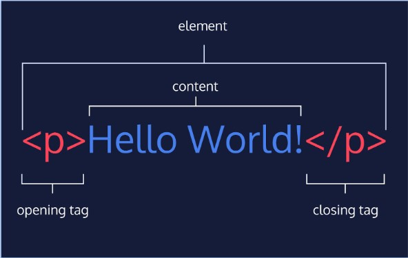
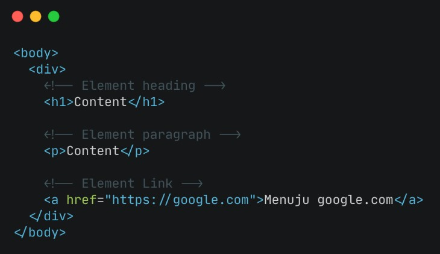
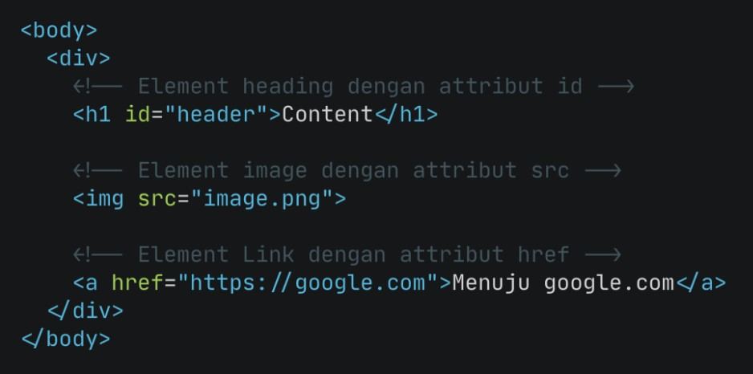
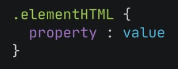
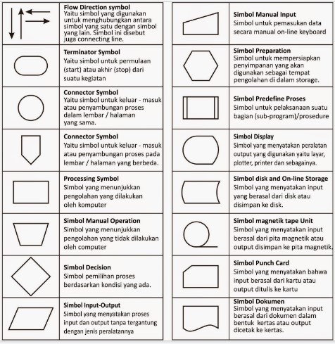
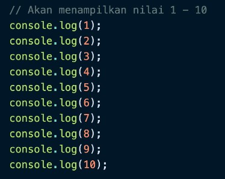

## Unix Command Line
> * __Apa itu Command Line Interface (CLI)?__  
> Saat kita menyebut `command line` atau `command line interface`, sebenarnya yang dimaksud adalah shell yang berbasis teks.  
> `Shell` ini adalah program yang menerima perintah, kemudian meneruskan perintah tersebut ke system untuk dieksekusi.  
> Selain command line, kita juga punya shell berbasis grafis yang lebih dikenal dengan nama `GUI atau graphical user interface.`  
* Contoh CLI
    + sh
    + bash
    + zsh
    + cmd.exe
    
> * __Filesystem__  
> Sebuah filesystem mengatur bagaimana data disimpan di dalam sebuah system 
> Sistem operasi Windows & Unix-like menyusun file dan direktori menggunakan struktur yang bentuknya mirip tree 
> __File System Tree__: Cara sistem operasi menyusun file-filenya dalam bentuk hierarki atau tree.

* Command untuk Navigasi
    + pwd
        - _Print working directory_. Command untuk melihat current working directory
    + ls
        - _Lists_. Command untuk melihat isi file yang ada di sebuah direktori
    + cd <direktori>
        - _change directory_. Command untuk berpindah direktori.
        
> * __Absolute Pathname & Relative Pathname__  
> __Absolute pathname__ dimulai dari root directory.  `/Users/user/Work/GitHub/skilvul/tugas`  
> __Relative pathname__ dimulai dari current working directory. `./catatan` (dari current working directory, kemudian ke ‘catatan’). `../skilvul/folder-lain` (naik ke parent directory dari directory saat ini atau back satu kali, kemudian ke ‘folder-lain’). `‘..’` (back atau naik ke directory di atas satu kali) 

* Membuat files & direktori
    + touch
        - Command untuk membuat sebuah file
    + mkdir
        - Command untuk membuat sebuah direktori
* Melihat isi files
    + head
        - Command untuk melihat beberapa line awal dari sebuah file text
    + tail
        - Command untuk melihat beberapa line akhir dari sebuah file text
    + cat
        - Command untuk melihat isi sebuah file        
* Menyalin, memindahkan, dan menghapus files & directory
    + cp
        - _copy_. Command untuk mengcopy files atau directory
    + mv
        - _move_. Command untuk memindahkan files atau directory. Bisa digunakan untuk rename.
    + rm
        - _remove_. Command untuk menghapus file atau directory
        
## Git & Github Dasar
> Git adalah salah satu tools yang wajib dikuasai oleh para programmer.  
> Git merupakan version control system yang digunakan untuk menyimpan, tracking,   
> dan me-manage perubahan pada code yang kita buat saat mengembangkan suatu aplikasi.  
> * __Remote repository :__ tempat untuk menyimpan git repo di internet 
> * __Github fork :__ untuk membuat copy dari repository orang lain ke akun kita  

### Tahap bekerja dengan Git
1. Working directory
   - Membuat file
   - Memodifikasi file
   - Menghapus file
2. Staging
   - files yang siap disimpan
3. Commit
   - Perubahan file disimpan sebagai commit

* Perintah dasar GIT
    + git init
        - membuat repository baru
    + git status
        - check repository status
    + git add
        - menambahkan files ke “staging”
    + git commit
        - menyimpan files di “staging” sebagai commit
    + git log
        - melihat histori perubahan
    + git diff
        - untuk melihat detail perubahan
    + git checkout
        - untuk kembali ke commit tertentu
    + git reset
        - untuk reset files ke sebuah commit, perubahan di branch yang dihapus menjadi ‘untracked files’
    + git revert
        - untuk undo commit, perubahan disimpan dalam commit 
        > Files yang perubahannya diabaikan didaftarkan pada `.gitignore`
    + git branch
        - untuk melihat branch yang ada. Branch aktif ditandai dengan `*`
    + git branch nama_branch
        - untuk membuat branch baru
    + git merge branch_target
        - untuk menggabungkan perubahan atau histori dari branch_target ke branch saat ini
    + git remote
        - untuk melihat daftar remote di repository
    + git remote add
        - untuk menambahkan remote
    + git push
        - untuk mengirim perubahan ke remote repository
    + git fetch
        - untuk mengambil metadata dari remote
    + git pull
        - untuk mengambil perubahan dari remote ke local. 
        > __Pull Request :__ proses review merge yang dibuat
    + git clone
        - untuk menyalin remote repository ke komputer kita 
    
## HTML
> __Hypertext Markup Language__  
> HTML digunakan untuk menampilkan konten pada browser.  
> HTML bersifat statis. HTML hanya bertugas menampilkan konten yang diminta oleh developer.  
> HTML bukanlah sebuah bahasa pemrograman, artinya HTML tidak bisa dinamis mengolah data.

* Contoh konten yang dapat ditampilkan seperti
    + Text
    + Image
    + Video 
    + Link
    + Dll

* Ada 2 tools utama yang harus dipersiapkan untuk membuat HTML
    + Browser
        - contoh: Chrome
    + Code Editor
        - contoh: Visual Studio Code
        > Visual Studio Code adalah code editor yang dikembangkan oleh tim engineer Microsoft.  
        > Visual Code Studio merupakan paket all in one. Kamu bisa menggunakan ini untuk bahasa pemrograman apapun.  
        > > Biasanya programmer memilih tools yang banyak digunakan oleh komunitas sesama developer.  
        > > Jika suatu tools atau bahasa pemrograman banyak digunakan oleh komunitas, itu artinya valid dan wajib digunakan.  
        > > __Keunggulan VSCode :__ Visual Studio Code dapat digunakan di Windows, Mac, dan juga Linux.  
        
### Dasar-dasar HTML
> Kita bisa menuliskan HTML tanpa structure dan kita bisa tetap menjalankan nya tetapi untuk menjalankannya dengan baik kita perlu HTML Structure  

### HTML Structure
> HTML tersusun sebagai kesatuan dari sebuah tingkatan (family tree relationship).  
> _Child Element : _ sebuah element berada di dalam element lain  
> _Parent Element : _ Element yang berada diatas element lain  

### HTML Anatomy

### HTML Element

### HTML Attributes
> Attribute adalah properties dari sebuah HTML Element.  
> Semua HTML Element memiliki attribute.  

### HTML Comment
> Programmer bisa disebut handal jika Kode yang dibuat dapat dengan mudah dimengerti oleh sesama programmer didalam tim misalnya.  
> Dengan menggunakan HTML Comment, kita dapat memberikan penjelasan maksud dari line code yang kita kerjakan.  
> > Comment ini pasti selalu ada dalam bahasa pemrograman apapun.  
> > Comment tidak akan dieksekusi oleh sistem.  
> > Comment hanya untuk dibaca oleh sesama programmer.  

## CSS
> __Apa itu CSS (Cascading Style Sheets)__  
> CSS adalah bahasa yang digunakan untuk mendesain halaman website.  
> Dengan CSS, kita bisa mengubah warna, menggunakan font custom, editing text format, mengatur tata letak, dan lainnya.  

### Struktur CSS

### CSS Comment
> Programmer bisa disebut handal jika code yang dibuat dapat dengan mudah dimengerti oleh sesama programmer di dalam tim misalnya.  
> Dengan menggunakan CSS Comment, kita dapat memberikan penjelasan maksud dari line code yang kita kerjakan.  
> > Comment ini pasti selalu ada dalam bahasa pemrograman apapun.  
> > Comment tidak akan dieksekusi oleh sistem.  
> > Comment hanya untuk dibaca oleh sesama programmer.  

* 3 Cara Menggunakan CSS
    + Inline Styles
        - Inline styles adalah kita menambahkan CSS pada attribute element HTML
    + The  Tag
        - Kita bisa menggunakan Tag `<style>` pada file HTML
    + CSS Files
        - Jika kita membutuhkan banyak code pada CSS, direkomendasikan untuk memisahkan code CSS di file tersendiri (extension .css) dan terpisah dari file HTML.
        >__Access file .css in HTML__
        > Tidak ada aturan baku untuk penempatan path file .css.  
        > Namun harus dalam 1 folder project yang sama.  

* Beberapa cara untuk mendesain element HTML di CSS
    + CSS - Tag Name
        - Kita bisa menggunakan Tag Elemen HTML secara langsung pada CSS. Jika menggunakan Tag Element, maka ini bersifat global.
        > Global artinya akan mempengaruhi seluruh Tag Elemen HTML yang ada pada file tersebut
    + CSS - Class Name
        - Kita bisa menggunakan attribute class pada elemen HTML lalu memanggil nama class tersebut pada CSS
        - HTML yang memiliki class yang sama, akan mempunyai styling yang sama saat digunakan pada CSS.
    + CSS - Multiple Class
        - Kita dapat menggunakan lebih dari 1 class yang berbeda untuk 1 element HTML
    + CSS - ID Name
        - Berbeda dengan Class Name. ID Name bersifat unik artinya hanya ada 1 nama ID pada 1 element HTML.
        - Gunakan (#namaID) saat memanggil element ID HTML pada CSS
    + Chaining Selectors
        - Chaining selector dapat kita gunakan pada case/kasus berikut : Jika kita memiliki 3 tag elemen HTML pada CSS namun kita ingin ada 1 elemen HTML yang memiliki styling berbeda.

### Nested Element
> Konsep CSS sama dengan HTML yaitu setiap element memiliki parent dan child.  

### !important CSS
> !important CSS berada di level paling atas dari ID dan Class.  
> Maksudnya adalah jika pada styling CSS kita menggunakan !important, maka styling sebelumnya baik itu ID Name atau Class Name akan di override.

### Multiple Selector
> Sebagai programmer handal, kita perlu latihan dan terbiasa membuat code yang efektif dengan tidak mengerjakan code yang sama berulang kali  
> Pada CSS kita bisa membuat code lebih efisien dan tidak repetitive (melakukan hal yang sama berulang-ulang).
        
## Algoritma
> __Apa itu Algoritma__  
> proses yang dilakukan dengan cara yg logis (masuk akal) dan sistematis (terurut)  
> __Seberapa penting sih Algoritma itu?__  
> programming itu justru identik dengan memecahkan suatu permasalahan, maka dari itu algoritma merupakan pemeran utamanya  
> Belajar algoritma sama aja dengan mengingat kembali alur berfikir yg terstruktur  
        
* Ciri-ciri algoritma
    + _Input : _ Memiliki 0 atau lebih inputan
    + _Output : _ Memiliki min 1 buah output
    + _Definiteness (pasti) : _ Instruksi jelas tidak ambigu
    + _Finiteness (ada batas) : _ Memiliki titik berhenti (stop)
    + _Effectiveness (tepat dan efisien) : _ Sebisa mungkin tepat sasaran dan efisien

* Jenis Proses Algoritma
    + _Sequence : _ Instruksi yg dijalankan secara berurutan
    + _Selection : _ Instruksi yg dijalankan jika memenuhi suatu kondisi
    + _Iteration : _ Instruksi yg berulang kali dijalankan selama memenuhi suatu kondisi
    + _Concurrent : _ Instruksi yg dijalankan secara bersamaan
  
* Penyajian Algoritma
    + _Deskriptif : _ Penulisan algoritma dengan cara deskriptif seperti kita menulis tutorial (tata cara) dengan bahasa sehari-hari.
    + _Flow Chart : _ Flow chart atau diagram alir, penyajian algoritmanya lebih mudah dibaca karena memiliki tampilan visual. Flow chart menggunakan simbol bangun datar sebagai representasi dari proses yg dilakukan.  
    
    + _Pseudo Code : _ Penulisan algoritma yg hampir menyerupai penulisan pada kode pemrograman disebut dengan pseudo code.
      - Pada umumnya pseudocode memiliki 3 bagian:
      > * Judul : Penjelasan dari algoritma yg dibuat
      > * Deklarasi : Mendefinisikan/menyiapkan semua nama (variabel) yg akan digunakan
      > * Deskripsi : langkah-langkah penyelesaian masalah
      > > Tidak ada aturan baku dalam penulisan pseudocode, asalkan:  
      > > * Jelas  
      > > * Simple  
      > > * Konsisten  
      > > * Dan mudah dibaca org lain  
  
## Intro to Javascript
> __Apa itu Javascript__  
> Javascript adalah bahasa pemograman yang sangat powerful yang digunakan untuk logic pada sebuah website  
> Javascript juga dapat membuat website menjadi interaktif dan dinamis  
> __Bagaimana menjalankan Javascript?__  
> Javascript dijalankan melalui browser pada device setiap user.  
> Umumnya browser Chrome dan Mozilla yang sudah support untuk semua fitur Javascript.  

### Syntax dan Statement
> Syntax bisa dianalogikan seperti kosa kata (vocabulary) dan tata cara (grammar) pada bahasa pemograman.  
> Kita menggunakan syntax tertentu untuk membuat statement program, instruksi untuk djalankan/dieksekusi oleh web browser, compiler, ataupun intrepreter  

### Console Log
> Console Log adalah hal yang krusial bagi developer web.  
> Console log adalah tempat kita untuk cek logic pemograman web yang kita kembangkan  
> Console log juga tempat kita untuk melakukan debugging (mengetahui error pada code) pada pemograman web  

### Comments
> Comments adalah sintaks yang digunakan untuk memberi keterangan tentang suatu statement. Menggunakan bahasa inggris atau bahasa indonesia.  
> Comments tidak akan dijalankan oleh program karena hanya untuk dibaca oleh sesama programmer ataupun diri sendiri untuk memahami maksud dan tujuan sebuah statement/syntax.  

### Tipe Data (Data Types)
> Tipe data adalah klasifikasi yang kita berikan untuk berbagai macam data yang digunakan dalam programming.
* Ada 6 tipe data fundamental pada Javascript
    + number
      - Tipe data number adalah tipe data yang mengandung semua angka termasuk angka desimal
    + string
      - Tipe data string adalah grup karakter yang ada pada keyboard laptop/PC kita yaitu letters (huruf), number (angka), spaces (spasi), symbol, dan lainnya.
      - Harus diawali dan diakhiri dengan single quotes ‘ … ‘ ataupun double quotes “ … “.
    + boolean
      - Tipe data boolean adalah tipe data yang hanya mempunyai 2 buah nilai : TRUE (benar) or FALSE (salah).
    + null
      - Tipe data null adalah tipe data yang diartikan bahwa sebuah variable/data tidak memiliki nilai.
      - Null berbeda dengan string kosong. String kosong masih memiliki tipe data string.
    + undefined
      - Tipe data undefined adalah tipe data yang merepresentasikan varibel/data yang tidak memiliki nilai.
      - Undefined berbeda dengan null : 
        > * Tipe data null biasanya diperoleh dalam kondisi normal dan sudah kita rencanakan. 
        > * Tipe data undefined biasanya didapat dari hasil kesalahan program (error), kelalaian programmer, dan tidak direncanakan.
      - Undefined didapat dari hasil berikut:
        > * Nilai dari pemanggilan variabel yang belum didefinisikan
        > * Nilai dari pemanggilan element array yang tidak ada
        > * Nilai dari pemanggilan property objek yang tidak ada
        > * Nilai dari pemanggilan fungsi yang tidak mengembalikan nilai (return)
        > * Nilai dari parameter fungsi yang tidak memiliki argumen
    + object
      - Tipe data object adalah koleksi data yang saling berhubungan (related). Tipe data pbject dapat menyimpan data dengan tipe data apapun (number, string, boolean, dan lainnya).
      - Tipe data object mempunyai key dan value.

### Variabel
> Disemua bahasa pemograman, variable adalah container/tempat untuk menyimpan sebuah nilai
* 3 hal yang dapat dilakukan pada variabel
    + Membuat variabel dengan nama yang jelas dan menggambarkan tentang data tersebut
    + Menyimpan dan mengupdate informasi/data yang disimpan
    + Mendapatkan/menampilan data yang tersimpan
* Ada 3 cara mendefinisikan sebuah variabel.
    + var
    + let
        - let dikenalkan pada versi javascript terbaru ES6
        - Variabel let mendukung kaidah global variabel dan local variabel
        - Jadi, dianjurkan untuk menggunak let untuk variabel yang dinamis/dapat diubah.
    + const
        - Gunakan const jika variabel tidak dapat diubah nilainya.
        - Biasanya digunakan untuk menggambarkan konstanta sebuah nilai. Seperti konstanta pi = 3.14.
* Aturan Penamaan Variabel
    + Harus mendeskripsikan tentang data yang disimpan
    + Tidak bisa menggunakan number pada awal nama variabel
    + Gunakan camelcase untuk penamaan yang lebih dari 1 kata.

### Operator
* Assignment Operator (=)
    + Assignment operator digunakan untuk menyimpan sebuah nilai pada variabel.
* Mathematical Assignment Operator
* Increment dan Decrement
    + Gunakan increment atau decrement untuk menambah atau mengurangi sebesar 1 nilai.
* Arithmetic Operator
    + Arithmetic operator adalah operator yang melibatkan operasi matematika.
        - Tambah (+)
        - Kuramg (-)
        - Perkalian (*)
        - Pembagian (/)
        - Modulus (%)
          > Modulus adalah hasil dari sisa bagi
* Comparison Operator
    + Comparison operator adalah operator yang membandingkan satu nilai dengan nilai lainnya.
    + Hasil operasi yang melibatkan comparison operator adalah antara true or false
    + Simbol comparison operator
      - Lebih kecil dari : <
      - Lebih besar dari: >
      - Lebih kecil atau sama dengan: <=
      - Lebih besar atau sama dengan: >=
      - Sama dengan: ===
      - Tidak sama dengan: !==
* Logical Operator
    + Logical operator biasa digunakan untuk sebuah CONDITIONAL pada pemograman.
    + Menghasilkan nilai BOOLEAN yaitu TRUE or FALSE.
    + Simbol dari Logical Operator adalah sebagai berikut:
      - AND operator : &&
        > AND akan menghasilkan nilai true jika kedua atau semua premis bernilai TRUE.
      - OR operator: ||
        > OR akan menghasilkan nilai true jika salah satu premis mengandung nilai TRUE
      - NOT operator: !
        > NOT akan membalikkan sebuah nilai BOOLEAN. TRUE menjadi FALSE dan sebaliknya.  
      
## Js Dasar-Conditional
> * __Apa itu Conditional__  
> Conditional merupakan statement percabangan yang menggambarkan suatu kondisi.  
> Conditional statement akan mengecek kondisi spesifik dan menjalankan perintah berdasarkan kondisi tersebut.  
> Yang dicek adalah apakah kondisi tersebut TRUE (benar).  
> Jika TRUE maka code didalam kondisi tersebut dijalankan.  

* Contoh Conditional
    + IF Statement
    + IF … ELSE Statement
      - Else akan mengeksekusi sebuah statement/code jika suatu kondisi bernilai FALSE 
    + IF .. ELSE IF Statement
      - Else … If statement dapat kita gunakan jika kita mempunyai berbagai kondisi.
    + Truthy and Falsy
      - Truthy and falsy digunakan untuk mengecek apakah variabel telah terisi namun tidak mementingkan nilainya.  
        > __Truthy and Falsy Assignment__  
        > Analoginya adalah jika kita memiliki sebuah website dan meminta inputan username lalu menampilkannya. Jika usernamenya kosong kita bisa isi nilai tersebut. 
    + Switch Case Conditional
      - Gunakan switch case jika kondisi dan percabangan terlalu banyak
    + Ternary Operator
      - Untuk lebih produktif, programmer harus belajar syntax singkat dari suatu fitur
      - Ternary operator merupakan short-syntax dari statement if … else.

## Js Dasar-Looping
> * __Apa itu Looping__  
> Looping adalah statement yang mengulang sebuah instruksi hingga kondisi terpenuhi atau jika kondisi stop/berhenti tercapai.  

* Manual Looping  
  
* For Loop
    + FOR LOOP merupakan instruksi pengulangan yang dapat kita berikan pada program yang kita kembangkan.
    + Gunakan FOR LOOP jika kita tahu seberapa banyak nilai pasti untuk pengulangannya
    + FOR LOOP PARAMETER
      - Inisialisasi: Sebagai inisialisasi awal dari mana mulainya sebuah pengulangan. Kita memberikan nilai awal/default pada parameter ini
      - Condition: For loop akan terus berjalan selama kondisi ini terpenuhi. Selama kondisi bernilai TRUE.
      - Post-expression (Increment/Decrement): Iterasi statement yang digunakan untuk mengupdate variabel yang menjadi kontrol pada pengulangan
* While Loop
    + WHILE LOOP akan menjalankan instruksi pengulangan kondisi bernilai TRUE.
    + Gunakan WHILE LOOP jika kita tidak mengetahui jumlah pasti pengulangan.
* Do While    
    + Terkadang kita ingin setidaknya menjalankan pengulangan 1 kali sebelum dilakukan pengecekan kondisi
* Nested Loop    
    + Jika kita membuat looping didalam looping. Maka ini dinamakan Nested Loop.
    + Looping pertama dianalogikan sebagai baris.
    + Looping kedua dianalogikan sebagai kolom
