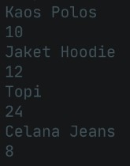
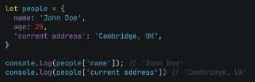
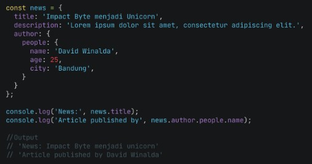
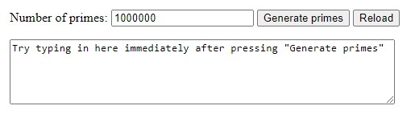
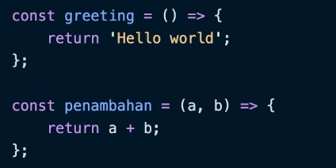
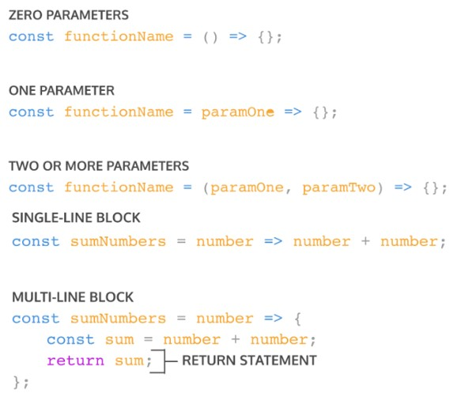
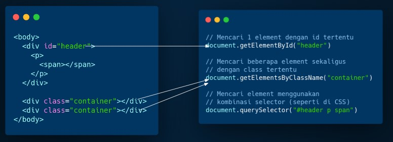
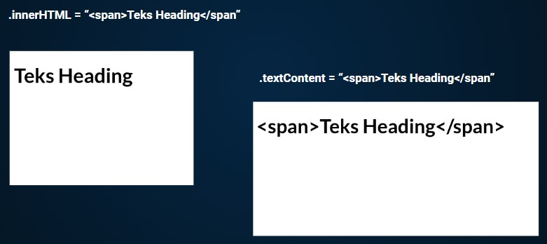

## JavaScript - Array
> * __Apa itu Array?__ </br>
> Array adalah tipe data list order yang dapat menyimpan tipe data apapun di dalamnya. </br>
> Array dapat menyimpan tipe data String, Number, Boolean, dan lainnya. </br>
> > Array digunakan untuk menyimpan lebih dari 1 data pada 1 variabel. </br>

### Contoh Array
```
let productTeam = ['Product Manager', 'Front End Developer', 'Back End Developer'];
console.log(productTeam);
```

### Membuat Array
* Array didefinisikan menggunakan square brackets `[]` </br>

### Mengakses/Memanggil Array
* Array pada javascript dihitung dari index data ke-0.
* Data pertama adalah index ke-0.
* Contoh
```
let cities = ['New York', 'Beijing', 'Nairobi'];
console.log(cities[0]);
```
> outputnya adalah `New York` </br>

### Update Array
* Seperti tipe data dan variabel pada umumnya, kita dapat mengupdate data pada Array.
* Contoh
```
let productTeam = ['Product Manager', 'Front End Developer', 'Back End Developer'];
productTeam[0] = 'Product Designer';
console.log(productTeam);
```
> outputnya adalah `['Product Designer', 'Front End Developer', 'Back End Developer']` </br>

### Const in Array
> * Jika menggunakan let, kita dapat mengubah array  dengan array baru dan konten nilai yang ada di dalam array dengan nilai lain
> * Const tidak bisa melakukan update data. Namun pada Array kita dapat melakukan update konten nilai di dalam array (mutable).
> * Yang tidak bisa adalah mengubah array dengan array yang baru jika menggunakan const. </br>
* Contoh
```
const productTeam = ['Product Manager', 'Front End Developer', 'Back End Developer'];
productTeam = ['Product Designer'];
console.log(productTeam);
```
> outputnya adalah `Error karena tidak bisa update array baru` </br>

```
const productTeam = ['Product Manager', 'Front End Developer', 'Back End Developer'];
productTeam[0] = ['Product Designer'];
console.log(productTeam);
```
> outputnya adalah `['Product Designer', 'Front End Developer', 'Back End Developer']` </br>

### Array Properties
* Array memiliki 5 properti yang sering digunakan yaitu constructor, length, index, input, dan prototype. 
* Properties adalah fitur yang sudah disediakan oleh Javascript untuk memudahkan developer.
* Contoh
> * __.length__ akan mengembalikan nilai dari jumlah panjang data suatu array. </br>
```
const productTeam = ['Product Manager', 'Front End Developer', 'Back End Developer'];
console.log(productTeam.length);
```
> outputnya adalah `3`

### Array Method
* Array memiliki method atau biasa disebut built-in methods. Artinya Javascript sudah memudahkan kita dengan menyediakan function/method umum yang bisa kita gunakan.
* Contoh Array Built-in Methods
> * __.push()__ adalah method untuk menambahkan item  array pada urutan yang paling akhir. </br>
> * __.pop()__ adalah method yang menghapus item array index terakhir. </br>
> * __.shift()__ adalah method untuk menghapus item Array pada index pertama. </br>
> * __.unshift()__ adalah method untuk menambahkan item Array pada index pertama </br>
> * __.sort()__ adalah method untuk mengurutkan secara Ascending atau Descending Alphanumeric. </br>

* __Looping pada Array__
* Array memiliki built in methods untuk melakukan looping yaitu `.map()` dan `.forEach()`
> * __.forEach()__ adalah method ntuk melakukan looping pada setiap elemen array. </br>
> * __.map()__ melakukan perulangan/looping dengan membuat array baru. </br>

## JavaScript - Multidimensional Array
> * __Apa itu Multidimensional Array?__ </br>
> Multidimensional Array bisa dianalogikan dengan array of array (Ada array didalam array). </br>
> Bayangkan multidimensional ini seperti `Table`. __Baris pada table itu menunjukan jumlah array. Column pada table itu menunjukan isi dari tiap array.__ </br>

### Akses index multidimensional array
* Contoh
```
let inventory = [
    ['Kaos Polos', 10],
    ['Jaket Hoodie', 22], 
    ['Topi', 24],
    ['Celana Jeans', 8]
  ];
console.log(inventory[1][0]);
```
> outputnya adalah `Jaket Hoodie` </br>

* Sama seperti array satu dimensi, multidimensional array juga dapat menggunakan Property dan Method built-in Array.
> * Operation using map in multidimensional array
> * Contoh 
```
let inventory = [
    ['Kaos Polos', 10],
    ['Jaket Hoodie', 22], 
    ['Topi', 24],
    ['Celana Jeans', 8]
  ];
  inventory.map(dataInventory =>{
    let terjual = 100 - dataInventory[1];
    dataInventory[2] = terjual;
    });
console.table(inventory);
```
> outputnya adalah  </br>
 </br>

### Looping For Multidimensional Array
* Contoh 
```
let inventory = [
    ['Kaos Polos', 10],
    ['Jaket Hoodie', 22], 
    ['Topi', 24],
    ['Celana Jeans', 8]
  ];
  inventory.forEach(baris) =>{
    baris.forEach((column) => {
        console.log(column);
        });
    });
console.table(inventory);
```
> outputnya adalah  </br>
 </br>

## JavaScript Object
> * __Apa itu Object?__ </br>
> Pada programming, object adalah sebuah tipe data pada variabel yang menyimpan properti dan fungsi (method) </br>
> > Properti adalah data lengkap dari sebuah object. </br>
> > Method adalah action dari sebuah object. Apa saja yang dapat dilakukan dari suatu object. </br>
> > Contoh perumpamaan : </br>
> >  </br>

### Membuat sebuah object
* Sama seperti tipe data sebelumnya. Object dapat diassign kedalam sebuah variabel.
* Contoh objek kosong
```
let person = {};
```

* Contoh objek dengan property
```
let person = {
   name: 'John Doe',
   age: 25,
   inVerified: true,
   };
```

* Sama seperti array, didalam object kita dapat menyimpan properti dengan tipe data apapun.

### Mengakses Object dan Property Object
> * __Mengakses seluruh object__ </br>
 </br>
> * __Mengakses properti object__ </br>
 </br>

* Gunakan single quote pada key jika menggunakan spasi seperti ‘current address’ </br>
 </br>
* Bracket Notation
  + Kita juga bisa menggunakan bracket notation saat memanggil properti dari sebuah object. </br>
     </br>

### Update Object
* Kita dapat melakukan update pada variabel dengan tipe data Object.
* Do’s
  + Object dapat mengupdate value dari key yang sudah tersedia
  + Object dapat menambahkan key dan value baru
* Dont’s
  + Jika menggunakan constant pada variable object. Kita tidak bisa mengganti seluruh data object dengan object yang baru.
  + Jadi jika membutuhkan untuk update seluruh data object gunakan ‘let’ pada saat deklarasi variabel.  

### Delete Object Property
* Kita dapat menghapus properti dari object menggunakan delete operator.
 </br>

### Method
* Jika value yang kita masukkan pada property berupa function. Maka itu disebut method.
* __Contoh__ : pada `console.log`, `console` adalah global javascript object. `log()` adalah property yang berupa function dari object console. Sehingga kita memanggil dengan cara `console.log()`.
* Kita bisa membuat method custom untuk kita gunakan pada aplikasi kita

### Nested Object
* Pada real application pasti ditemukan data object yang kompleks. Object yang berasal dari turunan object lainnya.
 </br>

### Pass by reference
* Kita bisa mengubah data yang ada pada object melalui sebuah function dan memasukkan object sebagai parameter function. Ini biasa disebut passed by reference.
 </br>

### Looping Object
* Jika kita ingin menampilkan seluruh object properti. Kita bisa menggunakan looping. Jadi tidak perlu mengakses secara manual memanggil setiap propertinya.
```
for(let key in object){
  ....
};
```

### Array of Object
* Object sama seperti Array yang bisa menyimpan banyak data. Kita dapat menggunakan array of object untuk data yang lebih dari satu.
* Contoh
 </br>

> Output </br>
 </br>

## Javascript - Recursive
> * __Apa itu Recursive?__ </br>
> Recursive adalah function yang memanggil dirinya sendiri sampai kondisi tertentu. </br>
> > Recursive kebanyakan digunakan untuk case matematika, fisika, kimia, dan yang berhubungan dengan calculation. </br>
> > Struktur recursive </br> 
```
function recursive(){
  ....
  recursive();
  ....
}
```
> > Recursive akan berhenti memanggil dirinya sendiri jika kondisi terpenuhi </br>
```
function recursive(){
  if(condition) {
    // stop calling itself
    // ....
    } else {
        recursive();
    }
}
```

* A New Paradigm:
  + procedural
  + conditional
  + looping
  + modular (function)
  + recursive

* Ciri dari rekursif:
  + Fungsi rekursif selalu memiliki kondisi yang menyatakan kapan fungsi tersebut berhenti. Kondisi ini harus dapat dibuktikan akan tercapai, karena jika tidak tercapai maka kita tidak dapat membuktikan bahwa fungsi akan berhenti, yang berarti algoritma kita tidak benar.
  + Fungsi rekursif selalu memanggil dirinya sendiri sambil mengurangi atau memecahkan data masukan setiap panggilannya. Hal ini penting diingat, karena tujuan utama dari rekursif ialah memecahkan masalah dengan mengurangi masalah tersebut menjadi masalah-masalah kecil.

* Contoh kasus rekursif
 </br>

## JavaScript Intermediate - Asynchronous - Introduction
> * __Apa itu Asynchronous?__ </br>
> Asynchronous programming adalah adalah teknik yang memungkinkan program untuk memulai task yang berpotensi berjalan lama dan masih dapat responsif terhadap events lain saat task itu berjalan, daripada harus menunggu sampai task itu selesai. Setelah task itu selesai, program akan ditampilkan dengan dengan hasilnya. </br>
> > Dimulai dengan melihat masalah dengan fungsi sinkron yang berjalan lama, yang membuat pemrograman asinkron menjadi suatu keharusan. </br>

### Synchronous programming
```
const name = 'Miriam';
const greeting = `Hello, my name is ${name}!`;
console.log(greeting);
// "Hello, my name is Miriam!"

```
* Pada Code di atas:
  1. Mendeklarasikan string `nama`
  2. Mendeklarasikan string lain `greeting` yang menggunakan string `name`
  3. Menampilkan `greeting` ke konsol JavaScript.
* Browser akan secara efektif steps melalui program satu baris pada satu waktu dalam urutan yang ditulis. Pada setiap titik, browser menunggu baris untuk menyelesaikan pekerjaannya sebelum melanjutkan ke baris berikutnya. Hal ini harus dilakukan karena setiap baris tergantung pada pekerjaan yang dilakukan pada baris sebelumnya. Hal itu membuatnya menjadi program yang sinkron.

### A long-running synchronous function
> Bagaimana jika synchronous function membutuhkan waktu lama? </br>
> * Contoh : </br>
> Program di bawah ini menggunakan algoritma yang sangat tidak efisien untuk menghasilkan banyak bilangan prima besar ketika user mengklik "Generate primes" button. Semakin tinggi jumlah bilangan prima yang ditentukan ser, semakin lama operasi akan berlangsung.
 </br>
```
<label for="quota">Number of primes:</label>
<input type="text" id="quota" name="quota" value="1000000" />

<button id="generate">Generate primes</button>
<button id="reload">Reload</button>

<div id="output"></div>
```
```
const MAX_PRIME = 1000000;

function isPrime(n) {
  for (let i = 2; i <= Math.sqrt(n); i++) {
    if (n % i === 0) {
      return false;
    }
  }
  return n > 1;
}

const random = (max) => Math.floor(Math.random() * max);

function generatePrimes(quota) {
  const primes = [];
  while (primes.length < quota) {
    const candidate = random(MAX_PRIME);
    if (isPrime(candidate)) {
      primes.push(candidate);
    }
  }
  return primes;
}

const quota = document.querySelector('#quota');
const output = document.querySelector('#output');

document.querySelector('#generate').addEventListener('click', () => {
  const primes = generatePrimes(quota.value);
  output.textContent = `Finished generating ${quota.value} primes!`;
});

document.querySelector('#reload').addEventListener('click', () => {
  document.location.reload();
});
```

### The trouble with long-running synchronous functions
 </br>
* Contoh : pada program sebelumnya ditambahkan text box yang bisa diketik oleh user. Coba klik "Generate primes" button dan coba ketik di text box segera setelahnya.
* Didapatkan bahwa saat fungsi generatePrimes() berjalan, program sama sekali tidak responsif: user tidak dapat mengetik apa pun, mengeklik apa pun, atau melakukan hal lain. 
> * Hal ini adalah masalah dasar dengan fungsi sinkron yang berjalan lama. Yang dibutuhkan adalah cara agar program: </br>
> 1. Mulai a long-running operation dengan memanggil fungsi. </br>
> 2. Meminta function tersebut mulai beroperasi dan segera return, agar program tetap bisa responsif terhadap event-event lainnya. </br>
> 3. Menotify hasil operasi ketika akhirnya selesai. </br>
> * Itulah tepatnya yang dapat dilakukan oleh synchronous functions. </br>


> > Method adalah action dari sebuah object. Apa saja yang dapat dilakukan dari suatu object. </br>
> > Contoh perumpamaan : </br>
> >  </br>

### Membuat sebuah object
* Sama seperti tipe data sebelumnya. Object dapat diassign kedalam sebuah variabel.
* Contoh objek kosong


* __Contoh__ : pada `console.log`, `console` adalah global javascript object. `log()` adalah property yang berupa function dari object console. Sehingga kita memanggil dengan cara `console.log()`.
* Kita bisa membuat method custom untuk kita gunakan pada aplikasi kita
 </br>

* Dont’s
  + Jika menggunakan constant pada variable object. Kita tidak bisa mengganti seluruh data object dengan object yang baru.
  + Jadi jika membutuhkan untuk update seluruh data object gunakan ‘let’ pada saat deklarasi variabel.  
        - Dengan parameter, function dapat menerima sebuah inputan data dan menggunakannya untuk melakukan task/tugas.
        - Saat membuat function/fitur, kita harus tahu data-data yang dibutuhkan. Misalnya saat membuat function penambahan 2 buah nilai. Data yang dibutuhkan adalah 2 buah nilai tersebut.
     + __Argumen Function__ </br>
     </br>
        - Argumen adalah nilai yang digunakan saat memanggil function.
        - Jumlah argumen harus sama dengan jumlah parameternya
        - Jadi jika di function penambahan ada 2 parameter nilai saat membuat function. Saat memanggil function kita gunakan 2 buah nilai argumen.

>Nantinya saat kita mengembangkan aplikasi dengan skala besar, function sangat sangat dibutuhkan agar kita dapat dengan mudah memanage code dan tracing code jika ada error.

* Default Parameters
    + Default paramaters digunakan untuk memberikan nilai awal/default pada parameter function.
    + Default parameters bisa digunakan jika kita ingin menjaga function agar tidak error saat dipanggil tanpa argumen </br>
     </br>
* Function Helper
    + Kita bisa menggunakan function yang sudah dibuat pada function lain. </br>
     </br>
* Arrow Function
    + Arrow function adalah cara lain menuliskan function. Ini adalah fitur terbaru yang ada pada ES6 (Javascript Version) </br>
     </br>
* Short Syntax Function </br>
     </br>

## Data Type Built in Prototype & Method
> * __Data Type__ </br>
> Data type dalam JavaScript terdiri dari Primitive dan Non-Primitive (Objek). Kedua kategori mewakili 2 cara berbeda tipe data ini disimpan ke dalam memori. Primitive disimpan berdasarkan nilai sedangkan Non-Primitive (Objek) disimpan berdasarkan referensi.</br>

* Primitive
  > Tipe data primitive hanya dapat menyimpan satu nilai pada satu waktu dan tidak dapat diubah menggunakan cara yang sama seperti tipe data non-primitif. Tipe data Primitif akan dianggap sama jika nilainya sama.
    + Boolean type
      - Boolean mewakili entitas logis dan dapat memiliki dua nilai: `true` dan `false`
    + Null type
      - Tipe Null memiliki tepat satu nilai: `null`
    + Undefined type
      - Variabel yang belum diberi nilai memiliki nilai yang tidak terdefinisi (`undefined`)
      > * ECMAScript memiliki dua tipe numerik bawaan: `Number` dan `BigInt` — bersama dengan nilai terkait `NaN`.
    + Number type
      - Number type adalah nilai IEEE 754 format biner 64-bit presisi ganda. Ia mampu menyimpan angka : 
        > * floating-point positif antara `2^-1074 (Number.MIN_VALUE)` dan `2^1024 (Number.MAX_VALUE)` serta angka </br>
        > * floating-point negatif antara `-(2^-1074) dan -(2^ 1024)`</br>
        > * tetapi hanya dapat menyimpan integer dengan aman dalam rentang `-(2^53 1) (Number.MIN_SAFE_INTEGER)` hingga `2^53 1 (Number.MAX_SAFE_INTEGER)`. </br>
        > > Nilai positif lebih besar dari Number.MAX_VALUE dikonversi ke `+Infinity`. <br>
        > > Nilai positif yang lebih kecil dari Number.MIN_VALUE dikonversi menjadi `+0`. <br>
        > > Nilai negatif yang lebih kecil dari -Number.MAX_VALUE dikonversi ke `-Infinity`. <br>
        > > Nilai negatif yang lebih besar dari -Number.MIN_VALUE dikonversi menjadi `-0`. <br>
    + BigInt type
      - Tipe BigInt adalah primitif numerik dalam JavaScript yang dapat mewakili bilangan bulat dengan presisi arbitrer. 
      - Dengan BigInts, kita dapat dengan aman menyimpan dan mengoperasikan bilangan bulat besar bahkan di luar batas bilangan bulat aman untuk Numbers.
      - Dengan BigInts, kita dapat beroperasi dengan angka di luar Number.MAX_SAFE_INTEGER.
    + NaN
      - __NaN ("Not a Number")__ biasanya ditemui ketika hasil operasi aritmatika tidak dapat dinyatakan sebagai angka. Ini juga satu-satunya nilai dalam JavaScript yang tidak sama dengan dirinya sendiri.
    + String type
      - Jenis String JavaScript digunakan untuk mewakili data tekstual dengan satu set "elemen" dari nilai integer 16-bit unsigned. 
      - Setiap elemen dalam String menempati posisi dalam String. 
      - Elemen pertama berada pada indeks 0, berikutnya pada indeks 1, dan seterusnya. 
      - Panjang dari sebuah String adalah jumlah elemen di dalamnya.
      - String JavaScript tidak dapat diubah. Namun, masih dimungkinkan untuk membuat string lain berdasarkan operasi pada string asli.
    + Symbol type
      - Simbol adalah nilai primitif yang unik dan tidak dapat diubah dan dapat digunakan sebagai kunci dari properti Objek. 
      - Dalam beberapa bahasa pemrograman, Simbol disebut "atom".

* Non-Primitive (Objek)
  > Dalam ilmu komputer, objek adalah nilai dalam memori yang mungkin dirujuk oleh identifier.
    + Properties
      - Dalam JavaScript, objek dapat dilihat sebagai kumpulan properti. Dengan sintaks literal objek, sekumpulan properti terbatas diinisialisasi; maka properti dapat ditambahkan dan dihapus. 
      - Nilai properti dapat berupa nilai jenis apa pun, termasuk objek lain, yang memungkinkan membangun struktur data yang kompleks. 
      - Properti diidentifikasi menggunakan nilai kunci. Nilai kunci adalah nilai String atau nilai Simbol.
      - Ada dua jenis properti objek: data property dan accessor property. Setiap properti memiliki atribut yang sesuai. Setiap atribut diakses secara internal oleh mesin JavaScript, tetapi dapat diatur melalui Object.defineProperty(), atau membacanya melalui Object.getOwnPropertyDescriptor().
        > * __Data property__ </br>
        > > Data properties mengaitkan key dengan value. Hal ini dapat dijelaskan dengan atribut berikut: <br>
        > > * value </br>
        > > > Nilai yang diambil oleh akses get properti. Dapat berupa nilai JavaScript apa pun. </br>
        > > * writable </br>
        > > > Nilai boolean yang menunjukkan apakah properti dapat diubah dengan penugasan. </br>
        > > * enumerable </br>
        > > > Nilai boolean yang menunjukkan jika properti dapat dihitung oleh `for...in loop`. </br>
        > > * configurable </br>
        > > > Nilai boolean yang menunjukkan apakah properti dapat dihapus, dapat diubah menjadi properti pengakses, dan dapat mengubah atributnya. </br>
        > * __Accesor property__ </br>
        > > Mengaitkan key dengan salah satu dari dua fungsi pengakses (dapatkan dan setel) untuk mengambil atau menyimpan nilai. Properti accessor memiliki atribut berikut: </br>
        > > * get </br>
        > > > Fungsi yang dipanggil dengan daftar argumen kosong untuk mengambil nilai properti setiap kali akses get ke nilai dilakukan. Mungkin juga `undefined`. </br>
        > > * set </br>
        > > > Fungsi yang dipanggil dengan argumen yang berisi nilai yang ditetapkan. Dieksekusi setiap kali properti tertentu dicoba untuk diubah. Mungkin juga `undefined`. </br>
        > > * enumerable </br>
        > > > Nilai boolean yang menunjukkan jika properti dapat dihitung oleh `for...in loop`. </br>
        > > * configurable </br>
        > > > Nilai boolean yang menunjukkan apakah properti dapat dihapus, dapat diubah menjadi properti pengakses, dan dapat mengubah atributnya. </br>
    + "Normal" objects, and functions
      - Objek JavaScript adalah pemetaan antara key dan value. Key adalah string (atau Simbol), dan value dapat berupa apa saja. 
      - Ini membuat objek cocok secara alami untuk peta hash.
      - Function adalah objek biasa dengan kemampuan tambahan yang dapat dipanggil.
    + Indexed collections: Arrays and typed Arrays
      - Array adalah objek reguler yang memiliki hubungan tertentu antara properti berkunci integer dan properti panjang. Selain itu, array mewarisi dari Array.prototype, yang menyediakan beberapa metode praktis untuk memanipulasi array. Misalnya, indexOf() (mencari nilai dalam array) atau push() (menambahkan elemen ke array), dan seterusnya.
      - Typed Arrays menyajikan tampilan seperti array dari buffer data biner yang mendasarinya, dan menawarkan banyak metode yang memiliki semantik serupa dengan rekan array. "Array yang diketik" adalah istilah umum untuk berbagai struktur data, termasuk `Int8Array`, `Float32Array`, dll.

> * __String__ </br>
> Data type dalam JavaScript terdiri dari Primitive dan Non-Primitive (Objek). Kedua kategori mewakili 2 cara berbeda tipe data ini disimpan ke dalam memori. Primitive disimpan berdasarkan nilai sedangkan Non-Primitive (Objek) disimpan berdasarkan referensi.</br>

* Creating strings
  + String dapat dibuat sebagai primitif, dari literal string, atau sebagai objek, menggunakan `String()`
* Character access
  + Ada dua cara untuk mengakses karakter individu dalam sebuah string. 
    - Yang pertama adalah metode charAt() 
    - Cara lain adalah dengan memperlakukan string sebagai objek seperti array, di mana karakter individu sesuai dengan indeks numerik
* Comparing strings
  + Dalam JavaScript, Anda cukup menggunakan operator kurang dari dan lebih besar dari
  + Perhatikan bahwa semua operator perbandingan, termasuk === dan ==, membandingkan string dengan peka huruf besar/kecil. 
  + Cara umum untuk membandingkan string dengan tidak peka huruf besar-kecil adalah dengan mengonversi keduanya menjadi huruf besar yang sama (atas atau bawah) sebelum membandingkannya.
    - Membuat huruf menjadi huruf besar (kapital) : `toUpperCase()`
    - Membuat huruf menjadi huruf kecil : `toLowerCase()` 
    - Namun Pilihan apakah akan mengubah dengan toUpperCase() atau toLowerCase() sebagian besar bersifat arbitrer, dan tidak ada yang sepenuhnya kuat saat melampaui abjad Latin. Misalnya, huruf kecil Jerman dan ss keduanya diubah menjadi SS oleh toUpperCase(), sedangkan huruf Turki akan salah dilaporkan sebagai tidak sama dengan I oleh toLowerCase() kecuali secara khusus menggunakan toLocaleLowerCase("tr"). 
    - Solusi yang peka terhadap lokal dan kuat untuk menguji kesetaraan peka huruf besar/kecil adalah dengan menggunakan API Intl.Collator atau metode localeCompare() string — keduanya berbagi antarmuka yang sama — dengan opsi sensitivitas disetel ke "aksen" atau "dasar".
    - Metode localeCompare() memungkinkan perbandingan string dengan cara yang sama seperti strcmp() — metode ini memungkinkan pengurutan string dengan cara yang locale-aware.


> * __Math__ </br>
> Math adalah objek bawaan yang memiliki properti dan metode untuk konstanta dan fungsi matematika. Ini bukan objek fungsi. </br>
> Math bekerja dengan tipe Number namun tidak bekerja dengan BigInt. </br>
> Tidak seperti banyak objek global lainnya, Math bukanlah sebuah konstruktor. Semua properti dan metode Math bersifat statis. Merujuk ke pi konstan sebagai Math.PI dan memanggil fungsi sinus sebagai Math.sin(x), di mana x adalah argumen metode. Konstanta didefinisikan dengan presisi penuh bilangan real dalam JavaScript. </br>

* Static properties
  + Math.E
    - Konstanta Euler dan basis logaritma natural; sekitar 2,718.
  + Math.LN2
    - Logaritma natural dari 2; sekitar 0,693.
  + Math.LN10
    - Logaritma natural 10; sekitar 2,303.
  + Math.LOG2E
    - logaritma basis-2 dari E; sekitar 1,443.
  + Math.LOG10E
    - logaritma basis-10 dari E; sekitar 0,434.
  + Math.PI
    - Rasio keliling lingkaran dengan diameternya; sekitar 3.14159.
  + Math.SQRT1_2
    - Akar kuadrat dari ; sekitar 0,707.
  + Math.SQRT2
    - Akar kuadrat dari 2; sekitar 1,414.

* Static methods
  + Math.abs()
    - Mengembalikan nilai absolut dari x.
  + Math.acos()
    - Mengembalikan arccosinus dari x.
  + Math.acosh()
    - Mengembalikan arccosinus hiperbolik dari x.
  + Math.asin()
    - Mengembalikan arcsine dari x.
  + Math.asinh()
    - Mengembalikan arcsinus hiperbolik suatu bilangan.
  + Math.atan()
    - Mengembalikan arctangent dari x.
  + Math.atanh()
    - Mengembalikan arktangen hiperbolik dari x.
  + Math.atan2()
    - Mengembalikan arctangent dari hasil bagi argumennya.
  + Math.cbrt()
    - Mengembalikan akar pangkat tiga dari x.
  + Math.ceil()
    - Mengembalikan bilangan bulat terkecil yang lebih besar dari atau sama dengan x.
  + Math.clz32()
    - Mengembalikan jumlah bit nol terdepan dari bilangan bulat 32-bit x.
  + Math.cos()
    - Mengembalikan kosinus dari x.
  + Math.cosh()
    - Mengembalikan kosinus hiperbolik dari x.
  + Math.exp()
    - Mengembalikan ex, di mana x adalah argumen, dan e adalah konstanta Euler (2,718…, basis logaritma natural).
  + Math.expm1()
    - Mengembalikan pengurangan 1 dari exp(x).
  + Math.floor()
    - Mengembalikan bilangan bulat terbesar yang kurang dari atau sama dengan x.
  + Math.fround()
    - Mengembalikan representasi float presisi tunggal terdekat dari x.
  + Math.hypot()
    - Mengembalikan akar kuadrat dari jumlah kuadrat argumennya.
  + Math.imul()
    - Mengembalikan hasil perkalian bilangan bulat 32-bit dari x dan y.
  + Math.log()
    - Mengembalikan logaritma natural (㏒e; juga, ) dari x.
  + Math.log1p()
    - Mengembalikan logaritma natural (㏒e; juga ) dari 1 + x untuk bilangan x.
  + Math.log10()
    - Mengembalikan logaritma basis-10 dari x.
  + Math.log2()
    - Mengembalikan logaritma basis-2 dari x.
  + Math.max()
    - Mengembalikan bilangan terbesar dari nol atau lebih.
  + Math.min()
    - Mengembalikan angka terkecil dari nol atau lebih.
  + Math.pow()
    - Mengembalikan basis x ke pangkat eksponen y (yaitu, xy).
  + Math.random()
    - Mengembalikan angka pseudo-acak antara 0 dan 1.
  + Math.round()
    - Mengembalikan nilai bilangan x yang dibulatkan ke bilangan bulat terdekat.
  + Math.sign()
    - Mengembalikan tanda x, yang menunjukkan apakah x positif, negatif, atau nol.
  + Math.sin()
    - Mengembalikan sinus dari x.
  + Math.sinh()
    - Mengembalikan sinus hiperbolik dari x.
  + Math.sqrt()
    - Mengembalikan akar kuadrat positif dari x.
  + Math.tan()
    - Mengembalikan tangen x.
  + Math.tanh()
    - Mengembalikan tangen hiperbolik dari x.
  + Math.trunc()
    - Mengembalikan bagian bilangan bulat dari x, menghapus setiap digit pecahan.

## JavaScript dan HTML DOM
> DOM bukan bagian dari JavaScript, melainkan browser (Web API) </br>
> * __Proses rendering di balik layar_ </br>
> HTML -> Parsing -> Tokens -> DOM </br>
> CSS -> Parsing -> Tokens -> CSSOM </br>
> DOM + CSSOM = Render Tree </br>
> Layouting </br>

* Isu terkait proses rendering
  + Jika saat proses parsing HTML, ditemukan tag <script>, secara default proses parsing akan dihentikan sampai script tersebut selesai diunduh dan dijalankan
  + Jika script yang diunduh itu besar, ada jeda yang cukup lama antara halaman mulai dimuat sampai keluar tampilan

* Solusi dari isu terkait proses rendering
  + Taruh tag <script> eksternal sebelum tag penutup </body> - ini solusi paling umum agar dia mulai diproses setelah parsing HTML selesai.
  + Taruh tag <script> sedini mungkin dan gunakan atribut async - atribut async akan membuat script tersebut diunduh tanpa menghentikan proses parsing dan dieksekusi seselesainya ia diunduh.
  + Untuk script yang bergantung pada DOM, taruh tag <script> sedini mungkin, dan gunakan atribut defer - atribut defer akan membuat script tersebut diunduh tanpa menghentikan proses parsing dan dieksekusi seselesainya proses parsing selesai.

* Memanipulasi Element HTML
  + Mencari Element HTML </br>
 </br>
  + Mengubah Konten Element
    - Element.textContent
      > Element.textContent dapat kita gunakan untuk mengubah teks di dalam sebuah element </br>
    - Element.innerHTML
      > Element.innerHTML dapat kita gunakan untukmengubah konten HTML di dalam sebuah element.
  > Perbandingan innerHTML dan textContent </br>
     </br>
    
* Membuat Element HTML
  1. .createElement() 
  2. .textContent untuk mengubah kontennya
  3. .appendChild() untuk menambahkan ke DOM

* Interaksi User (Events)   
    + User experience itu bersifat dua arah: selain menampilkan element HTML, halaman web juga harus bisa menangkap interaksi user

* Menangkap Interaksi User
  + Element.addEventListener(“event”)
  + Element.onevent

* EventListener </br>
  Dengan cara Element.addEventListener(“event”)
  + Bisa dihilangkan
  + Bisa ada beberapa event listener yang sama untuk 1 element
  + Memiliki argument tambahan { options }

* EventListener - Click </br>
  Misalkan kita mempunyai element <input id=”user-input” />  dan <button id=”alert-button”>show</button>. 
  Kita ingin menampilkan pop up box yang berisi teks di dalam input tadi. </br>
  ```
  // cari dulu kedua element tersebut berdasarkan id-nya

  const input = document.getElementById(“user-input”)
  const button = document.getElementById(“alert-button”)

  // baru tambahkan event listener
  button.addEventListener(“click”, function() {
	  alert(input.value)
    })

  // atau
  button.onclick = function() { alert(input.value) }
  ```

* EventListener - Blur </br>
  “Blur”, lawan dari “focus”, adalah event di mana sebuah element kehilangan fokus dari user (misal user klk mouse di luar element tersebut atau user klik tab untuk berpindah element)

  Misalkan kita ingin memvalidasi isi dari <input id=”username” /> agar panjangnya minimal 6 karakter. </br>
  ```
  // cari dulu element tersebut berdasarkan id-nya

  const input = document.getElementById(“username”)

  // tambahkan event listener
  input.addEventListener(“blur”, () => {
	  if(input.value.length < 6) alert(“Panjang username minimal 6”)
  })
  ```
  
* EventListener - Form Submission </br>
  Misalkan kita mempunyai element beberapa input dalam sebuah form <input name=”email /> dan <input type=”password” name=”password” />. Bagaimana caranya  kita mendapatkan isi dari kedua input tersebut saat submit form?

  Pasang event listener di form, lalu gunakan FormData untuk mengambil data dari masing-masing input </br>
  ```
  const form = document.getElementById(“form”)
  form.addEventListener(“submit”, function(event) {
	  // cegah page refresh
	  event.preventDefault()

	  const formData = new FormData(form)
	  const values = Object.fromEntries(formData) // { email: ... }
  })
  ```


