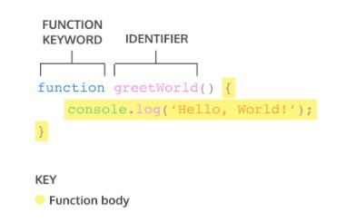

## Javascript - Scope
> * __Apa itu Scope?__ </br>
> Scope adalah konsep dalam flow data variabel. Menentukan suatu variabel bisa diakses pada scope tertentu atau tidak. </br>

> * __Blocks :__ code yang berada didalam curly braces {}. Conditional, function, dan  looping menggunakan blocks.</br>
> * __Global Scope :__ variabel yang kita buat dapat diakses dimanapun dalam suatu file. Agar menjadi Global Scope, suatu variabel harus dideklarasikan diluar Blocks.</br>
 </br>
> * __Local Scope :__berarti kita mendeklarasikan variabel didalam blocks seperti function, conditional, dan looping. Maka variabel hanya bisa diakses didalam blocks saja. Tidak bisa diakses diluar blocks. </br>
 </br>

## Javascript - Function
> * __Apa itu Function?__ </br>
> Function adalah sebuah blok kode dalam sebuah grup untuk menyelesaikan 1 task/1 fitur.</br>
> Saat kita membutuhkan fitur tersebut nantinya, kita bisa kembali menggunakannya.</br>

> * __Membuat Function__ </br>
 </br>
> * __Memanggil Function__ </br>
 </br>

* Parameter dan Argumen
    + __Parameter Function__ </br>
     </br>
        - Dengan parameter, function dapat menerima sebuah inputan data dan menggunakannya untuk melakukan task/tugas.
        - Saat membuat function/fitur, kita harus tahu data-data yang dibutuhkan. Misalnya saat membuat function penambahan 2 buah nilai. Data yang dibutuhkan adalah 2 buah nilai tersebut.
     + __Argumen Function__ </br>
     </br>
        - Argumen adalah nilai yang digunakan saat memanggil function.
        - Jumlah argumen harus sama dengan jumlah parameternya
        - Jadi jika di function penambahan ada 2 parameter nilai saat membuat function. Saat memanggil function kita gunakan 2 buah nilai argumen.

>Nantinya saat kita mengembangkan aplikasi dengan skala besar, function sangat sangat dibutuhkan agar kita dapat dengan mudah memanage code dan tracing code jika ada error.

* Default Parameters
    + Default paramaters digunakan untuk memberikan nilai awal/default pada parameter function.
    + Default parameters bisa digunakan jika kita ingin menjaga function agar tidak error saat dipanggil tanpa argumen </br>
     </br>
* Function Helper
    + Kita bisa menggunakan function yang sudah dibuat pada function lain. </br>
     </br>
* Arrow Function
    + Arrow function adalah cara lain menuliskan function. Ini adalah fitur terbaru yang ada pada ES6 (Javascript Version) </br>
     </br>
* Short Syntax Function </br>
     </br>

## Data Type Built in Prototype & Method
> * __Data Type__ </br>
> Data type dalam JavaScript terdiri dari Primitive dan Non-Primitive (Objek). Kedua kategori mewakili 2 cara berbeda tipe data ini disimpan ke dalam memori. Primitive disimpan berdasarkan nilai sedangkan Non-Primitive (Objek) disimpan berdasarkan referensi.</br>

* Primitive
  > Tipe data primitive hanya dapat menyimpan satu nilai pada satu waktu dan tidak dapat diubah menggunakan cara yang sama seperti tipe data non-primitif. Tipe data Primitif akan dianggap sama jika nilainya sama.
    + Boolean type
      - Boolean mewakili entitas logis dan dapat memiliki dua nilai: `true` dan `false`
    + Null type
      - Tipe Null memiliki tepat satu nilai: `null`
    + Undefined type
      - Variabel yang belum diberi nilai memiliki nilai yang tidak terdefinisi (`undefined`)
      > * ECMAScript memiliki dua tipe numerik bawaan: `Number` dan `BigInt` — bersama dengan nilai terkait `NaN`.
    + Number type
      - Number type adalah nilai IEEE 754 format biner 64-bit presisi ganda. Ia mampu menyimpan angka : 
        > * floating-point positif antara `2^-1074 (Number.MIN_VALUE)` dan `2^1024 (Number.MAX_VALUE)` serta angka </br>
        > * floating-point negatif antara `-(2^-1074) dan -(2^ 1024)`</br>
        > * tetapi hanya dapat menyimpan integer dengan aman dalam rentang `-(2^53 1) (Number.MIN_SAFE_INTEGER)` hingga `2^53 1 (Number.MAX_SAFE_INTEGER)`. </br>
        > > Nilai positif lebih besar dari Number.MAX_VALUE dikonversi ke `+Infinity`. <br>
        > > Nilai positif yang lebih kecil dari Number.MIN_VALUE dikonversi menjadi `+0`. <br>
        > > Nilai negatif yang lebih kecil dari -Number.MAX_VALUE dikonversi ke `-Infinity`. <br>
        > > Nilai negatif yang lebih besar dari -Number.MIN_VALUE dikonversi menjadi `-0`. <br>
    + BigInt type
      - Tipe BigInt adalah primitif numerik dalam JavaScript yang dapat mewakili bilangan bulat dengan presisi arbitrer. 
      - Dengan BigInts, kita dapat dengan aman menyimpan dan mengoperasikan bilangan bulat besar bahkan di luar batas bilangan bulat aman untuk Numbers.
      - Dengan BigInts, kita dapat beroperasi dengan angka di luar Number.MAX_SAFE_INTEGER.
    + NaN
      - __NaN ("Not a Number")__ biasanya ditemui ketika hasil operasi aritmatika tidak dapat dinyatakan sebagai angka. Ini juga satu-satunya nilai dalam JavaScript yang tidak sama dengan dirinya sendiri.
    + String type
      - Jenis String JavaScript digunakan untuk mewakili data tekstual dengan satu set "elemen" dari nilai integer 16-bit unsigned. 
      - Setiap elemen dalam String menempati posisi dalam String. 
      - Elemen pertama berada pada indeks 0, berikutnya pada indeks 1, dan seterusnya. 
      - Panjang dari sebuah String adalah jumlah elemen di dalamnya.
      - String JavaScript tidak dapat diubah. Namun, masih dimungkinkan untuk membuat string lain berdasarkan operasi pada string asli.
    + Symbol type
      - Simbol adalah nilai primitif yang unik dan tidak dapat diubah dan dapat digunakan sebagai kunci dari properti Objek. 
      - Dalam beberapa bahasa pemrograman, Simbol disebut "atom".

* Non-Primitive (Objek)
  > Dalam ilmu komputer, objek adalah nilai dalam memori yang mungkin dirujuk oleh identifier.
    + Properties
      - Dalam JavaScript, objek dapat dilihat sebagai kumpulan properti. Dengan sintaks literal objek, sekumpulan properti terbatas diinisialisasi; maka properti dapat ditambahkan dan dihapus. 
      - Nilai properti dapat berupa nilai jenis apa pun, termasuk objek lain, yang memungkinkan membangun struktur data yang kompleks. 
      - Properti diidentifikasi menggunakan nilai kunci. Nilai kunci adalah nilai String atau nilai Simbol.
      - Ada dua jenis properti objek: data property dan accessor property. Setiap properti memiliki atribut yang sesuai. Setiap atribut diakses secara internal oleh mesin JavaScript, tetapi dapat diatur melalui Object.defineProperty(), atau membacanya melalui Object.getOwnPropertyDescriptor().
        > * __Data property__ </br>
        > > Data properties mengaitkan key dengan value. Hal ini dapat dijelaskan dengan atribut berikut: <br>
        > > * value </br>
        > > > Nilai yang diambil oleh akses get properti. Dapat berupa nilai JavaScript apa pun. </br>
        > > * writable </br>
        > > > Nilai boolean yang menunjukkan apakah properti dapat diubah dengan penugasan. </br>
        > > * enumerable </br>
        > > > Nilai boolean yang menunjukkan jika properti dapat dihitung oleh `for...in loop`. </br>
        > > * configurable </br>
        > > > Nilai boolean yang menunjukkan apakah properti dapat dihapus, dapat diubah menjadi properti pengakses, dan dapat mengubah atributnya. </br>
        > * __Accesor property__ </br>
        > > Mengaitkan key dengan salah satu dari dua fungsi pengakses (dapatkan dan setel) untuk mengambil atau menyimpan nilai. Properti accessor memiliki atribut berikut: </br>
        > > * get </br>
        > > > Fungsi yang dipanggil dengan daftar argumen kosong untuk mengambil nilai properti setiap kali akses get ke nilai dilakukan. Mungkin juga `undefined`. </br>
        > > * set </br>
        > > > Fungsi yang dipanggil dengan argumen yang berisi nilai yang ditetapkan. Dieksekusi setiap kali properti tertentu dicoba untuk diubah. Mungkin juga `undefined`. </br>
        > > * enumerable </br>
        > > > Nilai boolean yang menunjukkan jika properti dapat dihitung oleh `for...in loop`. </br>
        > > * configurable </br>
        > > > Nilai boolean yang menunjukkan apakah properti dapat dihapus, dapat diubah menjadi properti pengakses, dan dapat mengubah atributnya. </br>
    + "Normal" objects, and functions
      - Objek JavaScript adalah pemetaan antara key dan value. Key adalah string (atau Simbol), dan value dapat berupa apa saja. 
      - Ini membuat objek cocok secara alami untuk peta hash.
      - Function adalah objek biasa dengan kemampuan tambahan yang dapat dipanggil.
    + Indexed collections: Arrays and typed Arrays
      - Array adalah objek reguler yang memiliki hubungan tertentu antara properti berkunci integer dan properti panjang. Selain itu, array mewarisi dari Array.prototype, yang menyediakan beberapa metode praktis untuk memanipulasi array. Misalnya, indexOf() (mencari nilai dalam array) atau push() (menambahkan elemen ke array), dan seterusnya.
      - Typed Arrays menyajikan tampilan seperti array dari buffer data biner yang mendasarinya, dan menawarkan banyak metode yang memiliki semantik serupa dengan rekan array. "Array yang diketik" adalah istilah umum untuk berbagai struktur data, termasuk `Int8Array`, `Float32Array`, dll.

> * __String__ </br>
> Data type dalam JavaScript terdiri dari Primitive dan Non-Primitive (Objek). Kedua kategori mewakili 2 cara berbeda tipe data ini disimpan ke dalam memori. Primitive disimpan berdasarkan nilai sedangkan Non-Primitive (Objek) disimpan berdasarkan referensi.</br>

* Creating strings
  + String dapat dibuat sebagai primitif, dari literal string, atau sebagai objek, menggunakan `String()`
* Character access
  + Ada dua cara untuk mengakses karakter individu dalam sebuah string. 
    - Yang pertama adalah metode charAt() 
    - Cara lain adalah dengan memperlakukan string sebagai objek seperti array, di mana karakter individu sesuai dengan indeks numerik
* Comparing strings
  + Dalam JavaScript, Anda cukup menggunakan operator kurang dari dan lebih besar dari
  + Perhatikan bahwa semua operator perbandingan, termasuk === dan ==, membandingkan string dengan peka huruf besar/kecil. 
  + Cara umum untuk membandingkan string dengan tidak peka huruf besar-kecil adalah dengan mengonversi keduanya menjadi huruf besar yang sama (atas atau bawah) sebelum membandingkannya.
    - Membuat huruf menjadi huruf besar (kapital) : `toUpperCase()`
    - Membuat huruf menjadi huruf kecil : `toLowerCase()` 
    - Namun Pilihan apakah akan mengubah dengan toUpperCase() atau toLowerCase() sebagian besar bersifat arbitrer, dan tidak ada yang sepenuhnya kuat saat melampaui abjad Latin. Misalnya, huruf kecil Jerman dan ss keduanya diubah menjadi SS oleh toUpperCase(), sedangkan huruf Turki akan salah dilaporkan sebagai tidak sama dengan I oleh toLowerCase() kecuali secara khusus menggunakan toLocaleLowerCase("tr"). 
    - Solusi yang peka terhadap lokal dan kuat untuk menguji kesetaraan peka huruf besar/kecil adalah dengan menggunakan API Intl.Collator atau metode localeCompare() string — keduanya berbagi antarmuka yang sama — dengan opsi sensitivitas disetel ke "aksen" atau "dasar".
    - Metode localeCompare() memungkinkan perbandingan string dengan cara yang sama seperti strcmp() — metode ini memungkinkan pengurutan string dengan cara yang locale-aware.


> * __Math__ </br>
> Math adalah objek bawaan yang memiliki properti dan metode untuk konstanta dan fungsi matematika. Ini bukan objek fungsi. </br>
> Math bekerja dengan tipe Number namun tidak bekerja dengan BigInt. </br>
> Tidak seperti banyak objek global lainnya, Math bukanlah sebuah konstruktor. Semua properti dan metode Math bersifat statis. Merujuk ke pi konstan sebagai Math.PI dan memanggil fungsi sinus sebagai Math.sin(x), di mana x adalah argumen metode. Konstanta didefinisikan dengan presisi penuh bilangan real dalam JavaScript. </br>

* Static properties
  + Math.E
    - Konstanta Euler dan basis logaritma natural; sekitar 2,718.
  + Math.LN2
    - Logaritma natural dari 2; sekitar 0,693.
  + Math.LN10
    - Logaritma natural 10; sekitar 2,303.
  + Math.LOG2E
    - logaritma basis-2 dari E; sekitar 1,443.
  + Math.LOG10E
    - logaritma basis-10 dari E; sekitar 0,434.
  + Math.PI
    - Rasio keliling lingkaran dengan diameternya; sekitar 3.14159.
  + Math.SQRT1_2
    - Akar kuadrat dari ; sekitar 0,707.
  + Math.SQRT2
    - Akar kuadrat dari 2; sekitar 1,414.

* Static methods
  + Math.abs()
    - Mengembalikan nilai absolut dari x.
  + Math.acos()
    - Mengembalikan arccosinus dari x.
  + Math.acosh()
    - Mengembalikan arccosinus hiperbolik dari x.
  + Math.asin()
    - Mengembalikan arcsine dari x.
  + Math.asinh()
    - Mengembalikan arcsinus hiperbolik suatu bilangan.
  + Math.atan()
    - Mengembalikan arctangent dari x.
  + Math.atanh()
    - Mengembalikan arktangen hiperbolik dari x.
  + Math.atan2()
    - Mengembalikan arctangent dari hasil bagi argumennya.
  + Math.cbrt()
    - Mengembalikan akar pangkat tiga dari x.
  + Math.ceil()
    - Mengembalikan bilangan bulat terkecil yang lebih besar dari atau sama dengan x.
  + Math.clz32()
    - Mengembalikan jumlah bit nol terdepan dari bilangan bulat 32-bit x.
  + Math.cos()
    - Mengembalikan kosinus dari x.
  + Math.cosh()
    - Mengembalikan kosinus hiperbolik dari x.
  + Math.exp()
    - Mengembalikan ex, di mana x adalah argumen, dan e adalah konstanta Euler (2,718…, basis logaritma natural).
  + Math.expm1()
    - Mengembalikan pengurangan 1 dari exp(x).
  + Math.floor()
    - Mengembalikan bilangan bulat terbesar yang kurang dari atau sama dengan x.
  + Math.fround()
    - Mengembalikan representasi float presisi tunggal terdekat dari x.
  + Math.hypot()
    - Mengembalikan akar kuadrat dari jumlah kuadrat argumennya.
  + Math.imul()
    - Mengembalikan hasil perkalian bilangan bulat 32-bit dari x dan y.
  + Math.log()
    - Mengembalikan logaritma natural (㏒e; juga, ) dari x.
  + Math.log1p()
    - Mengembalikan logaritma natural (㏒e; juga ) dari 1 + x untuk bilangan x.
  + Math.log10()
    - Mengembalikan logaritma basis-10 dari x.
  + Math.log2()
    - Mengembalikan logaritma basis-2 dari x.
  + Math.max()
    - Mengembalikan bilangan terbesar dari nol atau lebih.
  + Math.min()
    - Mengembalikan angka terkecil dari nol atau lebih.
  + Math.pow()
    - Mengembalikan basis x ke pangkat eksponen y (yaitu, xy).
  + Math.random()
    - Mengembalikan angka pseudo-acak antara 0 dan 1.
  + Math.round()
    - Mengembalikan nilai bilangan x yang dibulatkan ke bilangan bulat terdekat.
  + Math.sign()
    - Mengembalikan tanda x, yang menunjukkan apakah x positif, negatif, atau nol.
  + Math.sin()
    - Mengembalikan sinus dari x.
  + Math.sinh()
    - Mengembalikan sinus hiperbolik dari x.
  + Math.sqrt()
    - Mengembalikan akar kuadrat positif dari x.
  + Math.tan()
    - Mengembalikan tangen x.
  + Math.tanh()
    - Mengembalikan tangen hiperbolik dari x.
  + Math.trunc()
    - Mengembalikan bagian bilangan bulat dari x, menghapus setiap digit pecahan.

## JavaScript dan HTML DOM
> DOM bukan bagian dari JavaScript, melainkan browser (Web API) </br>
> * __Proses rendering di balik layar_ </br>
> HTML -> Parsing -> Tokens -> DOM </br>
> CSS -> Parsing -> Tokens -> CSSOM </br>
> DOM + CSSOM = Render Tree </br>
> Layouting </br>

* Isu terkait proses rendering
  + Jika saat proses parsing HTML, ditemukan tag <script>, secara default proses parsing akan dihentikan sampai script tersebut selesai diunduh dan dijalankan
  + Jika script yang diunduh itu besar, ada jeda yang cukup lama antara halaman mulai dimuat sampai keluar tampilan

* Solusi dari isu terkait proses rendering
  + Taruh tag <script> eksternal sebelum tag penutup </body> - ini solusi paling umum agar dia mulai diproses setelah parsing HTML selesai.
  + Taruh tag <script> sedini mungkin dan gunakan atribut async - atribut async akan membuat script tersebut diunduh tanpa menghentikan proses parsing dan dieksekusi seselesainya ia diunduh.
  + Untuk script yang bergantung pada DOM, taruh tag <script> sedini mungkin, dan gunakan atribut defer - atribut defer akan membuat script tersebut diunduh tanpa menghentikan proses parsing dan dieksekusi seselesainya proses parsing selesai.

* Memanipulasi Element HTML
  + Mencari Element HTML </br>
 </br>
  + Mengubah Konten Element
    - Element.textContent
      > Element.textContent dapat kita gunakan untuk mengubah teks di dalam sebuah element </br>
    - Element.innerHTML
      > Element.innerHTML dapat kita gunakan untukmengubah konten HTML di dalam sebuah element.
  > Perbandingan innerHTML dan textContent </br>
     </br>
    
* Membuat Element HTML
  1. .createElement() 
  2. .textContent untuk mengubah kontennya
  3. .appendChild() untuk menambahkan ke DOM

* Interaksi User (Events)   
    + User experience itu bersifat dua arah: selain menampilkan element HTML, halaman web juga harus bisa menangkap interaksi user

* Menangkap Interaksi User
  + Element.addEventListener(“event”)
  + Element.onevent

* EventListener </br>
  Dengan cara Element.addEventListener(“event”)
  + Bisa dihilangkan
  + Bisa ada beberapa event listener yang sama untuk 1 element
  + Memiliki argument tambahan { options }

* EventListener - Click </br>
  Misalkan kita mempunyai element <input id=”user-input” />  dan <button id=”alert-button”>show</button>. 
  Kita ingin menampilkan pop up box yang berisi teks di dalam input tadi. </br>
  ```
  // cari dulu kedua element tersebut berdasarkan id-nya

  const input = document.getElementById(“user-input”)
  const button = document.getElementById(“alert-button”)

  // baru tambahkan event listener
  button.addEventListener(“click”, function() {
	  alert(input.value)
    })

  // atau
  button.onclick = function() { alert(input.value) }
  ```

* EventListener - Blur </br>
  “Blur”, lawan dari “focus”, adalah event di mana sebuah element kehilangan fokus dari user (misal user klk mouse di luar element tersebut atau user klik tab untuk berpindah element)

  Misalkan kita ingin memvalidasi isi dari <input id=”username” /> agar panjangnya minimal 6 karakter. </br>
  ```
  // cari dulu element tersebut berdasarkan id-nya

  const input = document.getElementById(“username”)

  // tambahkan event listener
  input.addEventListener(“blur”, () => {
	  if(input.value.length < 6) alert(“Panjang username minimal 6”)
  })
  ```
  
* EventListener - Form Submission </br>
  Misalkan kita mempunyai element beberapa input dalam sebuah form <input name=”email /> dan <input type=”password” name=”password” />. Bagaimana caranya  kita mendapatkan isi dari kedua input tersebut saat submit form?

  Pasang event listener di form, lalu gunakan FormData untuk mengambil data dari masing-masing input </br>
  ```
  const form = document.getElementById(“form”)
  form.addEventListener(“submit”, function(event) {
	  // cegah page refresh
	  event.preventDefault()

	  const formData = new FormData(form)
	  const values = Object.fromEntries(formData) // { email: ... }
  })
  ```


