## JavaScript - Array
> * __Apa itu Array?__ </br>
> Array adalah tipe data list order yang dapat menyimpan tipe data apapun di dalamnya. </br>
> Array dapat menyimpan tipe data String, Number, Boolean, dan lainnya. </br>
> > Array digunakan untuk menyimpan lebih dari 1 data pada 1 variabel. </br>

### Contoh Array
```
let productTeam = ['Product Manager', 'Front End Developer', 'Back End Developer'];
console.log(productTeam);
```

### Membuat Array
* Array didefinisikan menggunakan square brackets `[]` </br>

### Mengakses/Memanggil Array
* Array pada javascript dihitung dari index data ke-0.
* Data pertama adalah index ke-0.
* Contoh
```
let cities = ['New York', 'Beijing', 'Nairobi'];
console.log(cities[0]);
```
> outputnya adalah `New York` </br>

### Update Array
* Seperti tipe data dan variabel pada umumnya, kita dapat mengupdate data pada Array.
* Contoh
```
let productTeam = ['Product Manager', 'Front End Developer', 'Back End Developer'];
productTeam[0] = 'Product Designer';
console.log(productTeam);
```
> outputnya adalah `['Product Designer', 'Front End Developer', 'Back End Developer']` </br>

### Const in Array
> * Jika menggunakan let, kita dapat mengubah array  dengan array baru dan konten nilai yang ada di dalam array dengan nilai lain
> * Const tidak bisa melakukan update data. Namun pada Array kita dapat melakukan update konten nilai di dalam array (mutable).
> * Yang tidak bisa adalah mengubah array dengan array yang baru jika menggunakan const. </br>
* Contoh
```
const productTeam = ['Product Manager', 'Front End Developer', 'Back End Developer'];
productTeam = ['Product Designer'];
console.log(productTeam);
```
> outputnya adalah `Error karena tidak bisa update array baru` </br>

```
const productTeam = ['Product Manager', 'Front End Developer', 'Back End Developer'];
productTeam[0] = ['Product Designer'];
console.log(productTeam);
```
> outputnya adalah `['Product Designer', 'Front End Developer', 'Back End Developer']` </br>

### Array Properties
* Array memiliki 5 properti yang sering digunakan yaitu constructor, length, index, input, dan prototype. 
* Properties adalah fitur yang sudah disediakan oleh Javascript untuk memudahkan developer.
* Contoh
> * __.length__ akan mengembalikan nilai dari jumlah panjang data suatu array. </br>
```
const productTeam = ['Product Manager', 'Front End Developer', 'Back End Developer'];
console.log(productTeam.length);
```
> outputnya adalah `3`

### Array Method
* Array memiliki method atau biasa disebut built-in methods. Artinya Javascript sudah memudahkan kita dengan menyediakan function/method umum yang bisa kita gunakan.
* Contoh Array Built-in Methods
> * __.push()__ adalah method untuk menambahkan item  array pada urutan yang paling akhir. </br>
> * __.pop()__ adalah method yang menghapus item array index terakhir. </br>
> * __.shift()__ adalah method untuk menghapus item Array pada index pertama. </br>
> * __.unshift()__ adalah method untuk menambahkan item Array pada index pertama </br>
> * __.sort()__ adalah method untuk mengurutkan secara Ascending atau Descending Alphanumeric. </br>

* __Looping pada Array__
* Array memiliki built in methods untuk melakukan looping yaitu `.map()` dan `.forEach()`
> * __.forEach()__ adalah method ntuk melakukan looping pada setiap elemen array. </br>
> * __.map()__ melakukan perulangan/looping dengan membuat array baru. </br>

## JavaScript - Multidimensional Array
> * __Apa itu Multidimensional Array?__ </br>
> Multidimensional Array bisa dianalogikan dengan array of array (Ada array didalam array). </br>
> Bayangkan multidimensional ini seperti `Table`. __Baris pada table itu menunjukan jumlah array. Column pada table itu menunjukan isi dari tiap array.__ </br>

### Akses index multidimensional array
* Contoh
```
let inventory = [
    ['Kaos Polos', 10],
    ['Jaket Hoodie', 22], 
    ['Topi', 24],
    ['Celana Jeans', 8]
  ];
console.log(inventory[1][0]);
```
> outputnya adalah `Jaket Hoodie` </br>

* Sama seperti array satu dimensi, multidimensional array juga dapat menggunakan Property dan Method built-in Array.
> * Operation using map in multidimensional array
> * Contoh 
```
let inventory = [
    ['Kaos Polos', 10],
    ['Jaket Hoodie', 22], 
    ['Topi', 24],
    ['Celana Jeans', 8]
  ];
  inventory.map(dataInventory =>{
    let terjual = 100 - dataInventory[1];
    dataInventory[2] = terjual;
    });
console.table(inventory);
```
> outputnya adalah  </br>
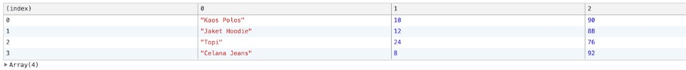 </br>

### Looping For Multidimensional Array
* Contoh 
```
let inventory = [
    ['Kaos Polos', 10],
    ['Jaket Hoodie', 22], 
    ['Topi', 24],
    ['Celana Jeans', 8]
  ];
  inventory.forEach(baris) =>{
    baris.forEach((column) => {
        console.log(column);
        });
    });
console.table(inventory);
```
> outputnya adalah  </br>
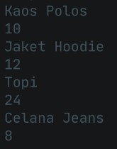 </br>

## JavaScript Object
> * __Apa itu Object?__ </br>
> Pada programming, object adalah sebuah tipe data pada variabel yang menyimpan properti dan fungsi (method) </br>
> > Properti adalah data lengkap dari sebuah object. </br>
> > Method adalah action dari sebuah object. Apa saja yang dapat dilakukan dari suatu object. </br>
> > Contoh perumpamaan : </br>
> > 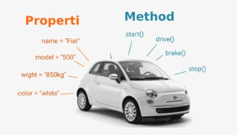 </br>

### Membuat sebuah object
* Sama seperti tipe data sebelumnya. Object dapat diassign kedalam sebuah variabel.
* Contoh objek kosong
```
let person = {};
```

* Contoh objek dengan property
```
let person = {
   name: 'John Doe',
   age: 25,
   inVerified: true,
   };
```

* Sama seperti array, didalam object kita dapat menyimpan properti dengan tipe data apapun.

### Mengakses Object dan Property Object
> * __Mengakses seluruh object__ </br>
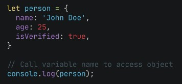 </br>
> * __Mengakses properti object__ </br>
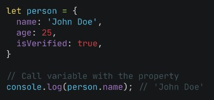 </br>

* Gunakan single quote pada key jika menggunakan spasi seperti ‘current address’ </br>
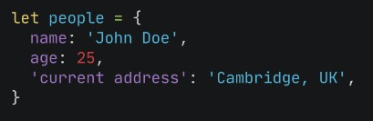 </br>
* Bracket Notation
  + Kita juga bisa menggunakan bracket notation saat memanggil properti dari sebuah object. </br>
    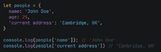 </br>

### Update Object
* Kita dapat melakukan update pada variabel dengan tipe data Object.
* Do’s
  + Object dapat mengupdate value dari key yang sudah tersedia
  + Object dapat menambahkan key dan value baru
* Dont’s
  + Jika menggunakan constant pada variable object. Kita tidak bisa mengganti seluruh data object dengan object yang baru.
  + Jadi jika membutuhkan untuk update seluruh data object gunakan ‘let’ pada saat deklarasi variabel.  

### Delete Object Property
* Kita dapat menghapus properti dari object menggunakan delete operator.
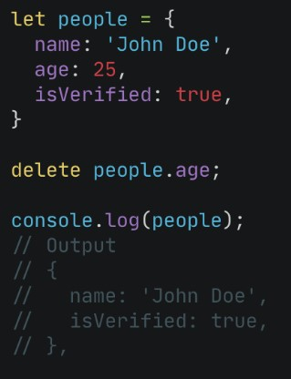 </br>

### Method
* Jika value yang kita masukkan pada property berupa function. Maka itu disebut method.
* __Contoh__ : pada `console.log`, `console` adalah global javascript object. `log()` adalah property yang berupa function dari object console. Sehingga kita memanggil dengan cara `console.log()`.
* Kita bisa membuat method custom untuk kita gunakan pada aplikasi kita

### Nested Object
* Pada real application pasti ditemukan data object yang kompleks. Object yang berasal dari turunan object lainnya.
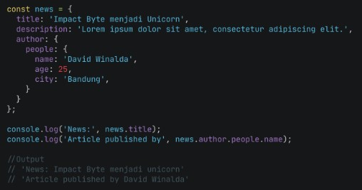 </br>

### Pass by reference
* Kita bisa mengubah data yang ada pada object melalui sebuah function dan memasukkan object sebagai parameter function. Ini biasa disebut passed by reference.
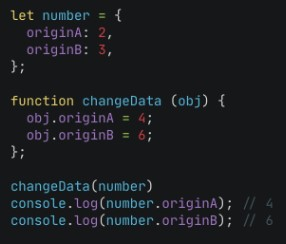 </br>

### Looping Object
* Jika kita ingin menampilkan seluruh object properti. Kita bisa menggunakan looping. Jadi tidak perlu mengakses secara manual memanggil setiap propertinya.
```
for(let key in object){
  ....
};
```

### Array of Object
* Object sama seperti Array yang bisa menyimpan banyak data. Kita dapat menggunakan array of object untuk data yang lebih dari satu.
* Contoh
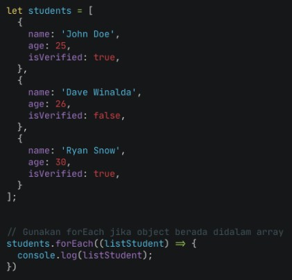 </br>

> Output </br>
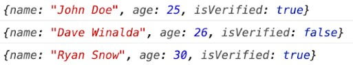 </br>

## Javascript - Recursive
> * __Apa itu Recursive?__ </br>
> Recursive adalah function yang memanggil dirinya sendiri sampai kondisi tertentu. </br>
> > Recursive kebanyakan digunakan untuk case matematika, fisika, kimia, dan yang berhubungan dengan calculation. </br>
> > Struktur recursive </br> 
```
function recursive(){
  ....
  recursive();
  ....
}
```
> > Recursive akan berhenti memanggil dirinya sendiri jika kondisi terpenuhi </br>
```
function recursive(){
  if(condition) {
    // stop calling itself
    // ....
    } else {
        recursive();
    }
}
```

* A New Paradigm:
  + procedural
  + conditional
  + looping
  + modular (function)
  + recursive

* Ciri dari rekursif:
  + Fungsi rekursif selalu memiliki kondisi yang menyatakan kapan fungsi tersebut berhenti. Kondisi ini harus dapat dibuktikan akan tercapai, karena jika tidak tercapai maka kita tidak dapat membuktikan bahwa fungsi akan berhenti, yang berarti algoritma kita tidak benar.
  + Fungsi rekursif selalu memanggil dirinya sendiri sambil mengurangi atau memecahkan data masukan setiap panggilannya. Hal ini penting diingat, karena tujuan utama dari rekursif ialah memecahkan masalah dengan mengurangi masalah tersebut menjadi masalah-masalah kecil.

* Contoh kasus rekursif
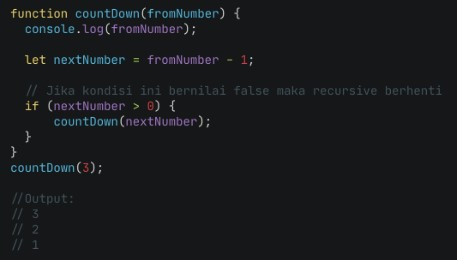 </br>

## JavaScript Intermediate - Asynchronous - Introduction
> * __Apa itu Asynchronous?__ </br>
> Asynchronous programming adalah adalah teknik yang memungkinkan program untuk memulai task yang berpotensi berjalan lama dan masih dapat responsif terhadap events lain saat task itu berjalan, daripada harus menunggu sampai task itu selesai. Setelah task itu selesai, program akan ditampilkan dengan dengan hasilnya. </br>
> > Dimulai dengan melihat masalah dengan fungsi sinkron yang berjalan lama, yang membuat pemrograman asinkron menjadi suatu keharusan. </br>

### Synchronous programming
```
const name = 'Miriam';
const greeting = `Hello, my name is ${name}!`;
console.log(greeting);
// "Hello, my name is Miriam!"

```
* Pada Code di atas:
  1. Mendeklarasikan string `nama`
  2. Mendeklarasikan string lain `greeting` yang menggunakan string `name`
  3. Menampilkan `greeting` ke konsol JavaScript.
* Browser akan secara efektif steps melalui program satu baris pada satu waktu dalam urutan yang ditulis. Pada setiap titik, browser menunggu baris untuk menyelesaikan pekerjaannya sebelum melanjutkan ke baris berikutnya. Hal ini harus dilakukan karena setiap baris tergantung pada pekerjaan yang dilakukan pada baris sebelumnya. Hal itu membuatnya menjadi program yang sinkron.

### A long-running synchronous function
> Bagaimana jika synchronous function membutuhkan waktu lama? </br>
> * Contoh : </br>
> Program di bawah ini menggunakan algoritma yang sangat tidak efisien untuk menghasilkan banyak bilangan prima besar ketika user mengklik "Generate primes" button. Semakin tinggi jumlah bilangan prima yang ditentukan ser, semakin lama operasi akan berlangsung.
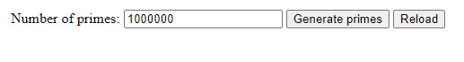 </br>
```
<label for="quota">Number of primes:</label>
<input type="text" id="quota" name="quota" value="1000000" />

<button id="generate">Generate primes</button>
<button id="reload">Reload</button>

<div id="output"></div>
```
```
const MAX_PRIME = 1000000;

function isPrime(n) {
  for (let i = 2; i <= Math.sqrt(n); i++) {
    if (n % i === 0) {
      return false;
    }
  }
  return n > 1;
}

const random = (max) => Math.floor(Math.random() * max);

function generatePrimes(quota) {
  const primes = [];
  while (primes.length < quota) {
    const candidate = random(MAX_PRIME);
    if (isPrime(candidate)) {
      primes.push(candidate);
    }
  }
  return primes;
}

const quota = document.querySelector('#quota');
const output = document.querySelector('#output');

document.querySelector('#generate').addEventListener('click', () => {
  const primes = generatePrimes(quota.value);
  output.textContent = `Finished generating ${quota.value} primes!`;
});

document.querySelector('#reload').addEventListener('click', () => {
  document.location.reload();
});
```

### The trouble with long-running synchronous functions
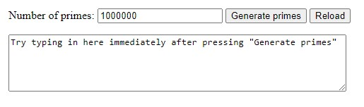 </br>
* Contoh : pada program sebelumnya ditambahkan text box yang bisa diketik oleh user. Coba klik "Generate primes" button dan coba ketik di text box segera setelahnya.
* Didapatkan bahwa saat fungsi generatePrimes() berjalan, program sama sekali tidak responsif: user tidak dapat mengetik apa pun, mengeklik apa pun, atau melakukan hal lain. 
> * Hal ini adalah masalah dasar dengan fungsi sinkron yang berjalan lama. Yang dibutuhkan adalah cara agar program: </br>
> 1. Mulai a long-running operation dengan memanggil fungsi. </br>
> 2. Meminta function tersebut mulai beroperasi dan segera return, agar program tetap bisa responsif terhadap event-event lainnya. </br>
> 3. Menotify hasil operasi ketika akhirnya selesai. </br>
> * Itulah tepatnya yang dapat dilakukan oleh synchronous functions. </br>

## JavaScript Intermediate - Asynchronous - Promise
> * __Apa itu Promise?__ </br>
> Contoh perumpamaan </br>
> > Bayangkan kamu masih kecil. Ibumu berjanji padamu bahwa dia akan membelikanmu ponsel baru minggu depan. </br>
> > Kamu tidak tahu apakah kamu akan mendapatkan ponsel itu sampai minggu depan. Ibumu benar-benar dapat membelikanmu ponsel baru, atau tidak. </br>
> > Hal tersebut yang dinamakan `promise`. </br>
> > Promise memiliki 3 keadaan : </br>
> > * __Pending__ : kamu tidak tahu apakah kamu akan mendapatkan ponsel itu
> > * __Fulfilled__ : Ibu senang, dia membelikanmu ponsel baru
> > * __Rejected__ : Ibu tidak senang, dia tidak membelikanmu ponsel

### Creating a Promise
Mari kita ubah ini menjadi JavaScript.
```
// ES5: Part 1

var isMomHappy = false;

// Promise
var willIGetNewPhone = new Promise(
    function (resolve, reject) {
        if (isMomHappy) {
            var phone = {
                brand: 'Samsung',
                color: 'black'
            };
            resolve(phone); // fulfilled
        } else {
            var reason = new Error('mom is not happy');
            reject(reason); // reject
        }

    }
);
```
Code itu sendiri cukup ekspresif. Di bawah ini adalah bagaimana promise syntax terlihat normal:
```
// promise syntax look like this
new Promise(function (resolve, reject) { ... } );
```

### Consuming Promises
```
// ES5: Part 2

var willIGetNewPhone = ... // continue from part 1

// call our promise
var askMom = function () {
    willIGetNewPhone
        .then(function (fulfilled) {
            // yay, you got a new phone
            console.log(fulfilled);
             // output: { brand: 'Samsung', color: 'black' }
        })
        .catch(function (error) {
            // oops, mom didn't buy it
            console.log(error.message);
             // output: 'mom is not happy'
        });
};

askMom();
```
* Output : </br>
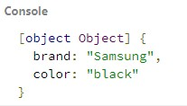 </br>

### Chaining Promises
* Promise bersifat `chainable`
* Contohkamu berjanji kepada temanmu bahwa kamu akan menunjukkan kepada mereka ponsel baru ketika ibumu membelikanmu. Maka hal itu adalah promise lain.
```
// ES5

// 2nd promise
var showOff = function (phone) {
    return new Promise(
        function (resolve, reject) {
            var message = 'Hey friend, I have a new ' +
                phone.color + ' ' + phone.brand + ' phone';

            resolve(message);
        }
    );
};
```
* dapat dipendekkan menjadi
```
// shorten it

// 2nd promise
var showOff = function (phone) {
    var message = 'Hey friend, I have a new ' +
                phone.color + ' ' + phone.brand + ' phone';

    return Promise.resolve(message);
};
```

* sehingga bisa dihubungkan dengan promise sebelumnya menjadi
```
// call our promise
var askMom = function () {
    willIGetNewPhone
    .then(showOff) // chain it here
    .then(function (fulfilled) {
            console.log(fulfilled);
         // output: 'Hey friend, I have a new black Samsung phone.'
        })
        .catch(function (error) {
            // oops, mom don't buy it
            console.log(error.message);
         // output: 'mom is not happy'
        });
};
```

### Promises are Asynchronous
* Mari kita catat pesan sebelum dan sesudah kita memanggil promise.
```
// call our promise
var askMom = function () {
    console.log('before asking Mom'); // log before
    willIGetNewPhone
        .then(showOff)
        .then(function (fulfilled) {
            console.log(fulfilled);
        })
        .catch(function (error) {
            console.log(error.message);
        });
    console.log('after asking mom'); // log after
}
```

* Apa urutan output yang diharapkan? Output yang kita kira :
   1. before asking Mom
   2. Hey friend, I have a new black Samsung phone.
   3. after asking mom
   
* Namun output yang sebenarnya adalah :
   1. before asking Mom
   2. after asking mom 
   3. Hey friend, I have a new black Samsung phone.


> > Kamu tidak akan berhenti bermain sambil menunggu promise ibumu (ponsel baru). Itu adalah sesuatu yang kami sebut asinkron: kode akan berjalan tanpa memblokir atau menunggu hasilnya. Apa pun yang perlu menunggu promise untuk melanjutkan dimasukkan ke dalam `.then`. </br>


> > Contoh full dalam ES5 : </br>
```
// ES5: Full example

var isMomHappy = true;

// Promise
var willIGetNewPhone = new Promise(
    function (resolve, reject) {
        if (isMomHappy) {
            var phone = {
                brand: 'Samsung',
                color: 'black'
            };
            resolve(phone); // fulfilled
        } else {
            var reason = new Error('mom is not happy');
            reject(reason); // reject
        }

    }
);

// 2nd promise
var showOff = function (phone) {
    var message = 'Hey friend, I have a new ' +
                phone.color + ' ' + phone.brand + ' phone';

    return Promise.resolve(message);
};

// call our promise
var askMom = function () {
    willIGetNewPhone
    .then(showOff) // chain it here
    .then(function (fulfilled) {
            console.log(fulfilled);
            // output: 'Hey friend, I have a new black Samsung phone.'
        })
        .catch(function (error) {
            // oops, mom don't buy it
            console.log(error.message);
            // output: 'mom is not happy'
        });
};

askMom();
```
## JavaScript Intermediate - Web Storage
> Ada beberapa cara untuk menyimpan data pengguna seperti pencarian, artikel berita, dan lain-lain ke lokal (browser) menggunakan web storage seperti cookies, local storage, dan session storage. </br>

### Apa itu Cookies?
* Cookies adalah data kecil yang dikirim dari situs web dan disimpan di komputer kita oleh web browser saat kita menjelajah.
*  Disebut data kecil karena maksimum data yang dapat disimpan dalam cookies adalah 4096 bytes (4 KB). 
* Biasanya data yang disimpan di cookies adalah access token pengguna saat login atau data pencarian saat melakukan pencarian pada situs web tertentu. 
> Hal ini yang biasanya dilakukan oleh situs pencarian untuk melacak pencarian kita dan menampilkan iklan yang berhubungan dengan pencarian kita sebelumnnya. </br>
> Namun ada beberapa kekurangan yang perlu kita perhatikan mengenai cookies di antaranya: </br>
> 1. Setiap kita mengakses situs web, cookies juga kembali dikirim sehingga memperlambat aplikasi web kamu dengan mengirimkan data yang sama. </br>
> 2. Cookies disertakan pada setiap HTTP request, sehingga mengirimkan data yang tidak dienkripsi melalui internet, maka saat kita ingin menyimpan data dalam cookies kita harus mengenkripsinya terlebih dahulu. </br>
> 3. Cookies hanya dapat menyimpan data sebanyak 4KB. </br>
> 4. Lalu cookies juga memiliki tanggal kadaluarsa. Tanggal ini telah ditentukan sehingga web browser bisa menghapus cookies jika tanggal sudah kadaluarsa atau tidak dibutuhkan. </br>

### Local Storage dan Session Storage
* Dengan memanfaatkan local storage dan session storage, kita dapat menyimpan data lebih besar yaitu 5MB per page tanpa mempengaruhi kinerja situs web. Namun, penting untuk diketahui agar kita tidak menyimpan data sensitif seperti password ke dalam local storage ataupun session storage untuk menghindari serangan pencurian data.

#### Local Storage
* __Local Storage - Menyimpan Data__ 
  + Local storage memiliki karakteristik sebagai berikut:
    1. Menyimpan data tanpa tanggal kadaluarsa.
    2. Data tidak akan dihapus ketika web browser ditutup dan akan tersedia seterusnya selama kita tidak menghapus data local storage pada web browser.
    3. Dapat menyimpan data hingga 5MB.
    4. Hanya dapat menyimpan data string.
  + Untuk menyimpan data pada local storage, kita menggunakan method `setItem()` yang membutuhkan 2 parameter. Parameter pertama adalah key yang ingin kita simpan dan parameter kedua adalah data (value) dari key yang akan disimpan.
  ```
  localStorage.setItem('key', value);
  ```

* __Local Storage - Mengambil Data__ 
  + Untuk mengambil data yang telah tersimpan pada local storage, kita dapat menggunakan method `getItem()` yang membutuhkan 1 parameter. Parameter tersebut adalah key dari data yang kita inginkan.
  ```
  localStorage.getItem('key');
  ```
* __Local Storage - Menghapus Data__ 
  + Untuk menghapus data yang telah tersimpan pada local storage, kita dapat menggunakan method `removeItem()` yang membutuhkan 1 parameter. Parameter tersebut adalah key dari data yang ingin kita hapus.
  ```
  // menghapus key tertentu
  localStorage.removeItem("key");
  // menghapus semua key
  localStorage.clear();
  ```
  
#### Session Storage
* __Session Storage - Menyimpan Data__ 
  + Berbeda dengan local storage, walaupun masuk ke dalam web storage, data yang tersimpan pada session storage akan hilang ketika session dari sebuah laman berakhir.
  + Session storage memiliki karakteristik sebagai berikut:
    1. Data yang disimpan pada session storage akan terus tersimpan selama browser terbuka dan tidak hilang jika laman di-reload.
    2. Membuka banyak tab/window dengan URL yang sama, akan menciptakan session storage yang berbeda di masing-masing tab/window.
    3. Menutup tab/window akan mengakhiri session dan menghapus data yang tersimpan di session storage pada tab/window tersebut.
    4. Data yang tersimpan dalam session storage harus berbentuk string.
    5. Hanya dapat menyimpan data sebanyak 5MB.
  + Sama dengan local storage, sintaks untuk menyimpan data pada session storage adalah sebagai berikut:
  ```
  // menambah session storage
  sessionStorage.setItem('key', value);
  ```

* __Session Storage - Mengambil Data__ 
  + Sama seperti local storage, cara mendapatkan data dari session storage juga menggunakan method `getItem()` seperti berikut ini:
  ```
  // mendapatkan session storage
  sessionStorage.getItem('key');
  ```
* __Session Storage - Menghapus Data__ 
  + Syntax untuk menghapus data dari session storage ada 2, yaitu:
  ```
  // menghapus session storage satu persatu berdasarkan key
  sessionStorage.removeItem('key');
  // menghapus seluruh session storage sekaligus
  sessionStorage.clear();
  ```


